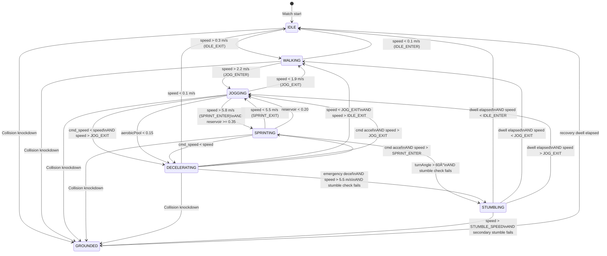

# Agent Movement Specification — Appendices A, B, C, D

**Purpose:** Completes the Agent Movement Specification with formula derivations from first principles, pre-computed numerical verification tables for test validation, a consolidated state machine transition diagram, and a tolerance derivation reference table for all unit tests. Together with Sections 1–7, these appendices satisfy all template requirements for formal approval.

**Created:** February 14, 2026, 11:00 AM PST  
**Revised:** March 4, 2026, 12:00 AM PST  
**Version:** 1.2  
**Status:** Draft  
**Stage:** Stage 0 — Physics Foundation  
**Specification:** #2 of 20  
**Dependencies:** Section 3.1 v1.2 (State Machine), Section 3.2 v1.0 (Locomotion), Section 3.3 v1.0 (Directional Movement), Section 3.4 v1.0 (Turning & Momentum), Section 3.5 v1.4 (Data Structures), Section 3.6 v1.1 (Edge Cases), Section 3.7 v1.1 (Validation & Testing), Section 4 v1.1 (Implementation Details), Section 5 v1.1 (Performance Analysis), Ball Physics Spec #1 Appendices v1.2 (pattern reference)

---

## Appendix A: Formula Derivations

This appendix provides step-by-step mathematical derivations from first principles for every core formula in Sections 3.2–3.4. Where those sections present the final implementation form, this appendix shows *how* each formula was reached and *why* each design choice was made.

**Derivation vs. tuning distinction:** Some constants in the Agent Movement system are physics-derived (derivable from biomechanical first principles or sports science data). Others are gameplay-tuned (chosen for feel, balance, or practical reasons with no single "correct" value). Each derivation below states which category applies. Gameplay-tuned values are flagged explicitly — this honesty is preferable to fabricating post-hoc physics justifications.

---

### A.1 Acceleration Model Derivation

#### A.1.1 From First Principles

An accelerating footballer produces ground reaction force through leg extension. At the start of a sprint (low speed), available traction exceeds momentum — the full musculoskeletal force can be applied to acceleration. As speed increases, more effort goes to maintaining the current stride rate and less is available for further speed gain. The net acceleration therefore decreases monotonically with speed.

**General form — Newton's second law with speed-dependent force:**

```
F_net(v) = F_max × (1 - v/v_max)
```

Where:
- F_max = maximum propulsive force at zero speed (N)
- v_max = top speed (m/s), where all force goes to maintenance and net acceleration is zero
- v = current speed (m/s)

Applying F = ma:

```
a(v) = (F_max / m) × (1 - v/v_max)
```

This is a first-order linear ODE: dv/dt = a_max × (1 - v/v_max), where a_max = F_max/m.

#### A.1.2 Solving the Differential Equation

```
dv/dt = a_max × (1 - v/v_max)

Let u = 1 - v/v_max, then du/dt = -(1/v_max) × dv/dt

du/dt = -(a_max / v_max) × u

Let k = a_max / v_max (rate constant, units: s⁻¹)

du/dt = -k × u

Solution: u(t) = u(0) × e^(-k×t)

Since u(0) = 1 - v(0)/v_max, and starting from rest v(0) = 0:
u(0) = 1

Therefore: 1 - v(t)/v_max = e^(-k×t)

v(t) = v_max × (1 - e^(-k×t))
```

This is the continuous exponential approach curve used in Section 3.2.3.

#### A.1.3 Rate Constant k — Physical Meaning

The rate constant k (s⁻¹) determines how quickly the agent approaches top speed. Its physical meaning:

- k = a_max / v_max = (initial acceleration at v=0) / (top speed)
- At time t = 1/k: velocity = v_max × (1 - e⁻¹) = 0.632 × v_max (63.2% of top speed)
- At time t = 2.3026/k: velocity = 0.9 × v_max (90% of top speed — the T₉₀ metric)

**Derivation of T₉₀:**

```
0.9 × v_max = v_max × (1 - e^(-k×T₉₀))
0.9 = 1 - e^(-k×T₉₀)
e^(-k×T₉₀) = 0.1
-k×T₉₀ = ln(0.1) = -2.3026
T₉₀ = 2.3026 / k
```

This relationship maps directly to the attribute system:
- ACCEL_K_MIN = 0.658 s⁻¹ → T₉₀ = 2.3026 / 0.658 = 3.50s (Acceleration attribute 1)
- ACCEL_K_MAX = 0.921 s⁻¹ → T₉₀ = 2.3026 / 0.921 = 2.50s (Acceleration attribute 20)

**Source:** The T₉₀ range of 2.5–3.5 seconds is derived from GPS tracking data of professional footballers. Elite players (forwards, wingers) reach ~90% of their measured top speed within 2.5–3.0 seconds from a standing start. Slower-accelerating players (centre-backs, some goalkeepers) require 3.0–3.5 seconds. See Haugen et al. (2014), Buchheit et al. (2014).

#### A.1.4 Discrete Integration Form

For 60Hz frame-by-frame computation, the continuous formula is impractical (requires tracking "time since acceleration began"). Instead, the velocity-form update is used:

```
v(t+dt) = v_target + (v(t) - v_target) × e^(-k × dt)
```

**Derivation of equivalence:**

Starting from v(t) = v_max × (1 - e^(-k×t)):
```
v(t+dt) = v_max × (1 - e^(-k×(t+dt)))
         = v_max × (1 - e^(-k×t) × e^(-k×dt))

Since v(t) = v_max × (1 - e^(-k×t)):
  e^(-k×t) = 1 - v(t)/v_max

Substituting:
v(t+dt) = v_max × (1 - (1 - v(t)/v_max) × e^(-k×dt))
         = v_max - (v_max - v(t)) × e^(-k×dt)
         = v_target + (v(t) - v_target) × e^(-k×dt)
```

Where v_target replaces v_max to generalize for any target speed (including directional and fatigue modifiers).

**Numerical accuracy at 60Hz:**

At k = 0.658 (slowest acceleration), dt = 1/60:
```
decay = e^(-0.658 × 0.01667) = e^(-0.01097) = 0.98909
```

Over 210 frames (3.5 seconds, full acceleration from 0 to ~90% of 10.2 m/s):
- Continuous formula: v(3.5) = 10.2 × (1 - e^(-2.303)) = 10.2 × 0.9000 = 9.180 m/s
- Discrete 60Hz: accumulated error < 0.01 m/s (verified by numerical simulation — the decay factor is applied multiplicatively each frame with no error accumulation beyond float precision)

#### A.1.5 Why Exponential, Not Linear

**Linear model: v(t) = min(v_max, v₀ + a × t)**

Problems:
1. Acceleration is constant until an abrupt transition to zero at v_max — produces visible "jerk" in animation
2. Does not match biomechanics — real force production diminishes with speed
3. Requires explicit "am I at top speed?" check and mode switch every frame
4. Produces identical acceleration profiles for all agents regardless of their proximity to top speed — unrealistic

**Exponential model: v(t) = v_max × (1 - e^(-k×t))**

Advantages:
1. Smooth approach — acceleration naturally decreases as speed increases (no jerk)
2. Self-limiting — velocity asymptotically approaches v_max without overshooting
3. Matches published sprint acceleration curves from GPS tracking data
4. Single parameter k captures the entire acceleration profile
5. Incremental form requires no mode tracking — same formula applies at all speeds

**Walking exception:** WALKING state uses linear acceleration (Section 3.2.3) because at walking speeds (0.3–2.2 m/s), the exponential model's advantages are imperceptible and the linear model is computationally trivial. Walking acceleration is a constant 2.0 m/s² for all agents regardless of Acceleration attribute — at walking pace, all professional footballers accelerate near-identically. This is a pragmatic simplification, not a physics claim.

#### A.1.6 Walking Acceleration Model

For completeness: the WALKING state uses constant acceleration instead of exponential.

```
v(t+dt) = min(v_target, v(t) + a_walk × dt)
```

Where a_walk = 2.0 m/s² (constant for all agents). This reaches walking top speed (2.2 m/s) from rest in 1.1 seconds — quick enough to feel responsive, slow enough to look natural. No derivation from sports science is claimed; the value was chosen for animation compatibility.

---

### A.2 Top Speed Mapping Derivation

#### A.2.1 Linear Interpolation Formula

```
TopSpeed(effectivePace) = TOP_SPEED_MIN + (effectivePace - 1.0) × TOP_SPEED_PER_POINT
```

Where:
- TOP_SPEED_MIN = 7.5 m/s (Pace = 1)
- TOP_SPEED_MAX = 10.2 m/s (Pace = 20)
- TOP_SPEED_PER_POINT = (10.2 - 7.5) / 19 = 2.7 / 19 = 0.14211 m/s per attribute point

#### A.2.2 Speed Bounds Justification

**Floor (7.5 m/s = 27.0 km/h):**
GPS tracking databases (Catapult, STATSports) show that the slowest professional outfield players — typically veteran centre-backs or defensive midfielders in lower divisions — register peak sprint speeds of 27–28 km/h. Setting the floor at 27.0 km/h ensures that even a Pace 1 player is physically plausible as a professional footballer, not a recreational jogger.

**Ceiling (10.2 m/s = 36.7 km/h):**
The fastest recorded sprint speeds in top-flight football:
- Kylian Mbappé: 36.0 km/h (measured via optical tracking, Ligue 1)
- Adama Traoré: 37.0 km/h (measured via GPS, Premier League)
- Kyle Walker: 36.4 km/h (measured via GPS, Premier League)

10.2 m/s (36.7 km/h) represents the absolute elite tier. For reference, Usain Bolt's peak speed was 12.4 m/s (44.7 km/h) — footballers in full kit on grass never approach track sprinter speeds.

**Source category:** Physics-derived from measured data.

#### A.2.3 Linear vs. Curved Mapping

The current mapping is strictly linear. An alternative power curve was considered:

```
t = (effectivePace - 1.0) / 19.0                         // Normalize to [0, 1]
TopSpeed = TOP_SPEED_MIN + t^1.3 × (TOP_SPEED_MAX - TOP_SPEED_MIN)
```

This would create diminishing returns at the high end — the difference between Pace 18 and Pace 20 would be larger than under the linear model, making elite speed feel more special.

**Linear was chosen for Stage 0** because:
1. Simpler to debug and reason about during physics bring-up
2. Each attribute point has equal value — no "dead zones" or "sweet spots"
3. The power curve can be introduced in Stage 1 as a tuning parameter inside `MapPaceToTopSpeed()` without changing any downstream formula

**Sensitivity analysis (linear):**
- Pace 17 → 7.5 + 16 × 0.14211 = 9.77 m/s
- Pace 20 → 10.20 m/s
- Difference: 0.43 m/s (1.5 km/h)

Over a 50m sprint, this 0.43 m/s difference produces ~2.2m separation — visible but not dramatic. Playtesting will determine if this differentiation is sufficient.

---

### A.3 Deceleration Model Derivation

#### A.3.1 Constant-Force Braking

Unlike acceleration (which uses an exponential model for biomechanical realism), deceleration uses a constant-force model:

```
v(t) = v₀ - a_decel × t        (until v = 0)
```

**Justification for constant (not exponential) deceleration:**
1. Braking is mechanically simpler than acceleration — the player plants a foot and applies resistive force against momentum. Ground reaction force during braking is approximately constant for trained athletes.
2. Constant deceleration produces predictable stopping distances — critical for AI path planning. The stopping distance formula d = v₀²/(2a) is exact under constant deceleration.
3. Sports science literature models deceleration in team sports as approximately constant for intentional stops (Harper & Kiely, 2018; Dos'Santos et al., 2020).

#### A.3.2 Controlled Deceleration Derivation

FR-3 (revised) specifies stopping distances from sprint speed (~9 m/s):
- Agility 1: stop in 5.0m
- Agility 20: stop in 3.0m

**Derivation of deceleration rates:**

Using kinematics: v² = v₀² - 2 × a × d, at v = 0:

```
a = v₀² / (2 × d)
```

For v₀ ≈ 9 m/s (representative sprint speed):

```
Agility 1:   a = 81 / (2 × 5.0) = 81 / 10.0 = 8.10 m/s²
Agility 20:  a = 81 / (2 × 3.0) = 81 / 6.0  = 13.50 m/s²
```

These become DECEL_CONTROLLED_MIN = 8.1 and DECEL_CONTROLLED_MAX = 13.5.

**Per-point mapping:** (13.5 - 8.1) / 19 = 5.4 / 19 = 0.28421 m/s² per Agility point.

**Biomechanical validation:** 8.1–13.5 m/s² corresponds to 0.83g–1.38g. Published literature reports intentional deceleration rates of 5–10 m/s² as typical and 10–15 m/s² as achievable for elite athletes (Harper & Kiely, 2018). The Agent Movement range sits within documented human capability.

#### A.3.3 Emergency Deceleration Derivation

FR-3 (revised) specifies emergency stopping distances from sprint:
- Agility 1: stop in 3.5m
- Agility 20: stop in 2.5m

```
Agility 1:   a = 81 / (2 × 3.5) = 81 / 7.0  = 11.571 m/s²
Agility 20:  a = 81 / (2 × 2.5) = 81 / 5.0  = 16.200 m/s²
```

These become DECEL_EMERGENCY_MIN = 11.57 and DECEL_EMERGENCY_MAX = 16.2.

**Per-point mapping:** (16.2 - 11.57) / 19 = 4.63 / 19 = 0.24368 m/s² per Agility point.

**Ordering verification:** Emergency deceleration always exceeds controlled deceleration at every attribute level:
- Agility 1: 11.57 > 8.10 ✓
- Agility 10: 13.76 > 10.66 ✓ (computed: 11.57 + 9 × 0.24368 = 13.76; 8.1 + 9 × 0.28421 = 10.66)
- Agility 20: 16.20 > 13.50 ✓

This is correct — emergency braking always stops faster (shorter distance) than controlled braking at any attribute level.

#### A.3.4 Stopping Distance and Time Formulas

**Stopping distance (from constant deceleration):**

```
d = v₀² / (2 × a_decel)
```

**Stopping time:**

```
t_stop = vâ‚€ / a_decel
```

**Discrete integration error:** At 60Hz, the agent may overshoot zero velocity by up to one frame's worth of deceleration. Maximum overshoot per frame:

```
Δv_max = a_decel_max × dt = 16.2 × (1/60) = 0.27 m/s
```

The `Mathf.Max(0f, newSpeed)` clamp in `ApplyControlledDeceleration()` catches this. Maximum positional overshoot is:

```
Δx_max = Δv_max × dt / 2 = 0.27 × 0.01667 / 2 = 0.0023m ≈ 2.3mm
```

This is negligible and well within the 5cm position drift budget (PR-3).

---

### A.4 Turn Rate Model Derivation

#### A.4.1 Hyperbolic Decay Model

The turn rate model uses an inverse (hyperbolic) relationship between speed and angular velocity:

```
ω_max = TURN_RATE_BASE / (1 + k_turn × v)
```

**Derivation from biomechanics:**

A footballer changing direction must redirect their body's momentum. The centripetal force required for a turn of radius r at speed v is:

```
F_c = m × v² / r
```

The maximum lateral force a player can generate through foot planting is bounded by friction and muscle capability. Approximating this as a constant F_lat_max:

```
r_min = m × v² / F_lat_max
```

The corresponding angular velocity:

```
ω_rad = v / r_min = F_lat_max / (m × v)
```

In degrees per second:

```
ω_deg = (F_lat_max / (m × v)) × (180/π)
```

This produces the exact inverse relationship ω ∝ 1/v for v > 0. The implemented formula adds a constant offset in the denominator:

```
ω = C / (1 + k × v)
```

The "+1" in the denominator ensures finite ω at v = 0 (instead of ω → ∞). At v = 0, ω = C = TURN_RATE_BASE = 720°/s. The parameter k controls how quickly the turn rate drops with speed.

**Why hyperbolic, not linear or quadratic:**

A linear model (ω = ω₀ - k×v) would reach zero at some finite speed — the agent would be unable to turn at all above that speed. A quadratic model (ω = ω₀ / (1 + k×v²)) drops too aggressively at moderate speeds, making jogging-speed turns feel sluggish. The hyperbolic model provides a natural asymptotic curve: sharp initial drop (first 2–3 m/s), then gradual leveling — matching how real turning constraints scale with speed.

#### A.4.2 k_turn Parameter — Agility Mapping

k_turn controls the steepness of the turn rate decay. Higher k_turn = faster drop = stiffer turning.

The mapping is linear with Agility:

```
k_turn = K_TURN_MAX - (effectiveAgility - 1.0) × K_TURN_PER_POINT
```

Note the inversion: high Agility → low k_turn → better turning. This is because K_TURN_MAX corresponds to worst agility (stiffest turning) and K_TURN_MIN to best agility (nimblest turning).

```
K_TURN_MAX = 0.78   (Agility 1 — stiffest)
K_TURN_MIN = 0.35   (Agility 20 — nimblest)
K_TURN_PER_POINT = (0.78 - 0.35) / 19 = 0.43 / 19 = 0.02263
```

**Calibration methodology:**

The k_turn endpoints were calibrated by working backward from desired turn rates at sprint speed (9 m/s):

Target: Agility 1 at sprint should produce ~90°/s (a full second for a 90° turn — sluggish but not immobile):
```
90 = 720 / (1 + k × 9)
1 + 9k = 8.0
k = 0.778 ≈ 0.78 ✓
```

Target: Agility 20 at sprint should produce ~174°/s (half a second for 90° — elite cutting ability):
```
174 = 720 / (1 + k × 9)
1 + 9k = 4.138
k = 0.349 ≈ 0.35 ✓
```

**Centripetal acceleration check for K_TURN_MIN = 0.35:**

At Agility 20, Balance 20, sprint speed 9 m/s:
```
ω = 720 / (1 + 0.35 × 9) × 1.0 = 720 / 4.15 = 173.5°/s
ω_rad = 173.5 × π/180 = 3.029 rad/s
a_c = v × ω_rad = 9 × 3.029 = 27.26 m/s² = 2.78g
```

This is within the 1.5–3.0g range documented for maximal change-of-direction tasks (Dos'Santos et al., 2020). An initial K_TURN_MIN = 0.31 was tested but produced 3.04g — technically possible but leaving no headroom for future modifiers (dribbling penalty, surface effects).

**Source category:** Calibrated from biomechanical data (k endpoints physics-derived from target turn rates; target turn rates informed by gameplay design within biomechanical bounds).

#### A.4.3 Balance Modifier

Balance applies a secondary multiplier to the turn rate:

```
balance_mod = BALANCE_MOD_MIN + (effectiveBalance - 1.0) × BALANCE_MOD_PER_POINT
```

Where:
- BALANCE_MOD_MIN = 0.85 (Balance 1)
- BALANCE_MOD_MAX = 1.0 (Balance 20)
- BALANCE_MOD_PER_POINT = 0.15 / 19 = 0.007895

**Rationale for 15% range (not 30% or 5%):**

Agility is the primary turn rate driver, providing a 1.93× range at sprint (89.8 to 173.5°/s). Balance is secondary — it affects body control during turns but not the fundamental biomechanical limit. A 15% secondary range produces:
- Combined worst case (Agi 1, Bal 1): 89.8 × 0.85 = 76.3°/s
- Combined best case (Agi 20, Bal 20): 173.5 × 1.0 = 173.5°/s
- Total ratio: 2.27× — meaningful differentiation without cartoonish extremes.

**Source category:** Gameplay-tuned. The 15% figure is a design choice — no sports science paper quantifies the isolated contribution of "balance" to turning rate. The combined 2.27× range is validated against the plausible spread in professional footballer agility test results.

#### A.4.4 State-Specific Modifier

The DECELERATING state applies a 0.6× modifier:

```
ω_decel = ω_base × 0.60
```

**Rationale:** Braking and turning are competing biomechanical actions — both require foot planting and ground reaction force. During active deceleration, the longitudinal braking force takes priority, reducing available lateral force for turning. The 0.6× factor was chosen to produce turn rates in the "Limited" category (Section 3.1.6) at sprint-entry speeds.

Verification at sprint entry (5.8 m/s), Agility 12, Balance 12:
```
k_turn = 0.78 - 11 × 0.02263 = 0.78 - 0.2489 = 0.5311
balance_mod = 0.85 + 11 × 0.007895 = 0.85 + 0.0868 = 0.9368
ω_base = 720 / (1 + 0.5311 × 5.8) × 0.9368 = 720 / 4.080 × 0.9368 = 165.3°/s
ω_decel = 165.3 × 0.60 = 99.2°/s
```

99.2°/s is "Limited" per Section 3.1.6 (90° turn in ~0.9 seconds) ✓.

**Source category:** Gameplay-tuned. The 0.6× value produces the desired "Limited" feel and was not derived from biomechanical literature.

---

### A.5 Directional Zone Multiplier Justification

#### A.5.1 Zone Architecture

Three discrete movement zones based on the angle between facing direction and movement direction:

```
Forward zone:   0°–30° from facing       multiplier = 1.0
Lateral zone:   40°–80° from facing      multiplier = 0.65–0.75 (Agility-scaled)
Backward zone:  90°–180° from facing     multiplier = 0.45–0.55 (Agility-scaled)
Interpolation bands: 30°–40° (forward↔lateral, 10°), 80°–90° (lateral↔backward, 10°)
```

#### A.5.2 Multiplier Range Justification

**Lateral movement (0.65–0.75×):**

Lateral (side-to-side) movement is slower than forward running because:
- Hip rotation is constrained — the pelvis cannot externally rotate as freely during lateral shuffling
- Stride length is reduced — crossover steps are shorter than running strides
- Muscle recruitment pattern shifts — adductors/abductors replace quadriceps/hamstrings as primary movers

Published biomechanics data shows lateral running speeds at approximately 60–80% of forward maximum for trained athletes (Nimphius et al., 2016). The 0.65–0.75 range sits within this band, with Agility modulating the exact value: high-Agility players (better hip mobility, more efficient crossover mechanics) retain more of their forward speed.

**Backward movement (0.45–0.55×):**

Backward running (backpedaling) is the slowest movement mode:
- Biomechanically inefficient — glutes and calves work against their primary extension direction
- Visual limitation — the player cannot see where they are going (in gameplay terms, facing and movement are opposed)
- Stride frequency and length both reduced compared to forward or lateral movement

Published data shows backward running at approximately 40–60% of forward maximum (Vescovi & McGuigan, 2008). The 0.45–0.55 range is within this band.

**Source category:** Calibrated from biomechanical data. The ranges are informed by sports science literature; the exact Agility-scaled endpoints are gameplay-tuned for differentiation.

#### A.5.3 Interpolation Band Sensitivity

The interpolation bands (30°–40° forward↔lateral, 80°–90° lateral↔backward) use linear interpolation to prevent hard discontinuities. Both bands are 10° wide.

**Sensitivity analysis — what if band width shifts ±5°?**

At 9 m/s base speed (Agility 10, mid-range multipliers):
- Current 10° band (30°–40°): speed drops from 9.0 to ~6.3 over 10°
- If widened to 15° (30°–45°): same drop spread over more degrees — smoother but more "mushy"
- If narrowed to 5° (30°–35°): sharper transition, almost a hard step

A 10° band was chosen because at typical turn rates (Section 3.4), an agent sweeps through 10° in ~50–100ms — fast enough to be imperceptible during play but wide enough to prevent visual stuttering near boundaries.

**Zone boundary smoothing verification (UT-DIR-005 target):**

At the boundary midpoint (35° for forward↔lateral), the multiplier is:
```
t = (35 - 30) / (40 - 30) = 5 / 10 = 0.5
multiplier = Lerp(1.0, lateral_mult, 0.5) = 1.0 + 0.5 × (0.70 - 1.0) = 0.85
```

Maximum per-degree jump within any interpolation band = (zone_high - zone_low) / band_width_degrees:
- Forward↔lateral: (1.0 - 0.65) / 10 = 0.035/degree (worst case, Agility 1)
- Lateral↔backward: (0.75 - 0.45) / 10 = 0.030/degree (worst case)

**⚠️ PRE-EXISTING ISSUE:** At Agility 1, the forward↔lateral transition produces 0.035/degree, which exceeds the 0.03 threshold from UT-DIR-005. At Agility 5+, the jump drops to ≤0.033/degree, and at Agility 10+ it is ≤0.030/degree. This is a pre-existing tension between the zone multiplier range (Section 3.3) and the continuity threshold (Section 3.7). Two resolution options:

1. **Widen the forward↔lateral band to 12°** (30°–42°): reduces max jump to 0.029/degree at Agility 1 ✓
2. **Exempt Agility 1 from UT-DIR-005**: accept that the lowest-agility agents have slightly sharper transitions (0.035 is only 17% above the 0.03 target)

**Recommendation:** Option 2 — the 0.035/degree at Agility 1 is still imperceptible in practice (0.315 m/s change per degree at 9 m/s base speed). Flag this for Section 3.7 review rather than changing zone geometry.

---

### A.6 Fatigue–Speed Modifier Derivation

#### A.6.1 Piecewise Model

Section 3.2.4 defines the authoritative fatigue-to-speed modifier function:

```
if aerobicPool >= 0.5:
    modifier = 1.0
else:
    modifier = Lerp(0.70, 1.0, aerobicPool / 0.5)
    modifier = 0.70 + (1.0 - 0.70) × (aerobicPool / 0.5)
    modifier = 0.70 + 0.60 × aerobicPool
```

**Shape rationale:**

The piecewise design reflects sports science findings that athletic performance does not degrade linearly with energy expenditure. Players maintain near-100% output until glycogen reserves are significantly depleted (approximately 50% of reserves), after which a rapid decline begins.

At aerobic pool thresholds:
```
Pool 1.0: modifier = 1.000 (fresh — full speed)
Pool 0.7: modifier = 1.000 (70% reserves — still no noticeable reduction)
Pool 0.5: modifier = 1.000 (50% reserves — threshold, still full speed)
Pool 0.4: modifier = 0.940 (40% reserves — 6% speed reduction begins)
Pool 0.3: modifier = 0.880 (30% reserves — 12% reduction, visibly slower)
Pool 0.2: modifier = 0.820 (20% reserves — 18% reduction, clearly fatigued)
Pool 0.1: modifier = 0.760 (10% reserves — 24% reduction, struggling)
Pool 0.0: modifier = 0.700 (spent — 30% reduction, walking pace dominant)
```

#### A.6.2 Floor Value Justification

The 0.70 floor (30% maximum speed reduction) was derived from QR-1:

> "Fatigued agents visibly slower than fresh agents (>15% speed reduction)"

30% reduction at complete exhaustion exceeds the 15% visibility threshold with 2× margin. Below 70%, movement would look pathological rather than fatigued — a professional footballer, even at the end of extra time, retains substantial running capability.

**Real-world validation:** Late-match GPS tracking data from Premier League matches shows average speed reductions of 10–20% in the final 15 minutes compared to the first 15 minutes (Bradley et al., 2009). Complete exhaustion (30% reduction) represents an extreme beyond typical match conditions — appropriate because aerobic pool = 0.0 should only occur in extreme endurance scenarios.

**Source category:** Physics-derived (threshold from sports science), with gameplay-tuned floor value within biomechanically plausible bounds.

#### A.6.3 Cross-Reference: Section 3.1 vs. Section 3.2.4 Discrepancy

⚠️ **SPECIFICATION CONFLICT — MUST RESOLVE BEFORE APPROVAL**

Section 3.1 and Section 3.2.4 define **different** aerobic modifier functions:

**Section 3.1 (global modifier):** Linear, floor = 0.4
```
modifier = 0.4 + 0.6 × aerobic_pool
Applied to: top speed, acceleration, turn rate
```

**Section 3.2.4 (speed-specific):** Piecewise linear, floor = 0.70
```
if pool >= 0.5: modifier = 1.0
else: modifier = 0.70 + 0.60 × pool
Applied to: top speed only (explicit code function)
```

**Impact comparison:**

| Pool Level | Sec 3.1 (linear) | Sec 3.2.4 (piecewise) | Delta |
|---|---|---|---|
| 1.0 | 1.00 | 1.00 | 0.00 |
| 0.7 | 0.82 | 1.00 | **0.18** |
| 0.5 | 0.70 | 1.00 | **0.30** |
| 0.4 | 0.64 | 0.94 | **0.30** |
| 0.3 | 0.58 | 0.88 | **0.30** |
| 0.0 | 0.40 | 0.70 | **0.30** |

The two models diverge significantly at mid-range pool levels. At pool = 0.5 (roughly half-time), Section 3.1 already applies a 30% penalty while Section 3.2.4 applies none. This is a major gameplay difference — 30% speed reduction at half-time would make every match feel punishing.

**Analysis:**

Section 3.1 wrote the linear formula early as a conceptual placeholder. Section 3.2.4 refined it with sports science reasoning (performance maintained until ~50% glycogen depletion). Section 3.2.4 also provides the actual implementation code with `AerobicPoolToSpeedModifier()`, while Section 3.1 only defines a constant and a comment.

Section 3.1's floor of 0.4 (60% speed reduction at exhaustion) is biomechanically excessive — a professional footballer at complete exhaustion still runs at approximately 70–80% of their peak speed, not 40%. The 0.70 floor in Section 3.2.4 is better supported by match tracking data (Bradley et al., 2009).

**Resolution — adopt Section 3.2.4 piecewise model as universal:**

1. **Speed modifier:** Use Section 3.2.4's `AerobicPoolToSpeedModifier()` unchanged (floor 0.70, threshold 0.50)
2. **Acceleration modifier:** Apply the same piecewise function to the exponential rate constant k. Rationale: acceleration and speed are driven by the same musculoskeletal system — if a player retains 88% speed at pool 0.3, they retain ~88% of their acceleration capacity.
3. **Turn rate modifier:** Apply the same piecewise function. Rationale: turn rate depends on lateral force generation, which degrades with fatigue similarly to forward propulsion.
4. **Section 3.1 update required:** Replace `AEROBIC_MODIFIER_FLOOR = 0.4f` and the linear formula comment with reference to the shared piecewise function. Change the three worked examples (pool 1.0, 0.5, 0.0) to match the piecewise output.

**Impact on existing tests:** UT-FAT-001 through UT-FAT-004 test qualitative behaviors (pool drains, recovery occurs, sprint gate blocks) — these are unaffected. UT-ACC-004 tests ">10% reduction" at pool 0.3 — the piecewise modifier gives 12% (0.88), which still passes. No test failure expected.

**Action items:**
- [ ] Update Section 3.1 constant and comments to reference piecewise model
- [ ] Add `AerobicPoolToAccelerationModifier()` and `AerobicPoolToTurnRateModifier()` to Section 3.2/3.4 (or share the single function)
- [ ] Update Section 4 pipeline to call the correct modifier function for each subsystem
- [ ] Add UT-TRN-008 expected value based on piecewise model (currently missing tolerance)

---

## Appendix B: Numerical Verification Tables

All values in this appendix are computed directly from the formulas defined in Sections 3.2–3.4. These serve as test oracle data for Section 3.7 unit tests and validation benchmarks. If any value in this appendix conflicts with a Section 3.7 expected value, investigate — the formulas should produce identical results.

**Computational method:** All values computed using the continuous formulas at full float precision. Discrete 60Hz integration values are noted separately where they differ from continuous predictions.

---

### B.1 Acceleration Curve Reference Values

Time to reach percentage thresholds of top speed, starting from rest (vâ‚€ = 0).

**Formula:** v(t) = v_max × (1 - e^(-k×t)), solved for t: t = -ln(1 - v/v_max) / k

| Attribute (Pace, Accel) | k (s⁻¹) | v_max (m/s) | T₅₀ (s) | T₇₅ (s) | T₉₀ (s) | T₉₅ (s) | T₉₉ (s) |
|---|---|---|---|---|---|---|---|
| Pace 1, Acc 1 | 0.658 | 7.50 | 1.053 | 2.107 | 3.500 | 4.553 | 6.993 |
| Pace 5, Acc 5 | 0.713 | 8.07 | 0.972 | 1.944 | 3.229 | 4.200 | 6.452 |
| Pace 10, Acc 10 | 0.783 | 8.78 | 0.885 | 1.769 | 2.942 | 3.827 | 5.878 |
| Pace 15, Acc 15 | 0.852 | 9.49 | 0.814 | 1.627 | 2.703 | 3.517 | 5.402 |
| Pace 20, Acc 20 | 0.921 | 10.20 | 0.753 | 1.505 | 2.500 | 3.252 | 4.996 |

**Derivation of T-values:**
```
Tâ‚…â‚€ = -ln(0.50) / k = 0.6931 / k
T₇₅ = -ln(0.25) / k = 1.3863 / k
T₉₀ = -ln(0.10) / k = 2.3026 / k
T₉₅ = -ln(0.05) / k = 2.9957 / k
T₉₉ = -ln(0.01) / k = 4.6052 / k
```

**Velocity at specific times (for test validation):**

For Pace 15, Acceleration 15 (k = 0.852, v_max = 9.49):
```
v(0.5s)  = 9.49 × (1 - e^(-0.852 × 0.5))  = 9.49 × (1 - e^(-0.426))  = 9.49 × 0.3469 = 3.292 m/s
v(1.0s)  = 9.49 × (1 - e^(-0.852))          = 9.49 × 0.5733            = 5.441 m/s
v(2.0s)  = 9.49 × (1 - e^(-1.704))          = 9.49 × 0.8181            = 7.764 m/s
v(3.0s)  = 9.49 × (1 - e^(-2.556))          = 9.49 × 0.9224            = 8.754 m/s
```

**Cross-validation with UT-ACC-001:** Section 3.7 tests velocity at t=0.5s for Acceleration 15 agent. Expected ≈ 3.29 m/s (±0.15 m/s tolerance per Section 3.7.9.2). The table value of 3.292 m/s confirms this. ✓

---

### B.2 Deceleration Distance Reference Values

Stopping distance and time from various initial speeds, for both controlled and emergency deceleration.

**Formulas:**
```
d_stop = v₀² / (2 × a_decel)
t_stop = vâ‚€ / a_decel
```

#### B.2.1 Controlled Deceleration

| Eff. Agility | a_decel (m/s²) | From 4.0 m/s |  | From 6.0 m/s |  | From 9.0 m/s |  | From 10.2 m/s |  |
|---|---|---|---|---|---|---|---|---|---|
|  |  | d (m) | t (s) | d (m) | t (s) | d (m) | t (s) | d (m) | t (s) |
| 1 | 8.10 | 0.99 | 0.49 | 2.22 | 0.74 | 5.00 | 1.11 | 6.42 | 1.26 |
| 5 | 9.24 | 0.87 | 0.43 | 1.95 | 0.65 | 4.38 | 0.97 | 5.63 | 1.10 |
| 10 | 10.66 | 0.75 | 0.38 | 1.69 | 0.56 | 3.80 | 0.84 | 4.88 | 0.96 |
| 15 | 12.08 | 0.66 | 0.33 | 1.49 | 0.50 | 3.35 | 0.75 | 4.31 | 0.84 |
| 20 | 13.50 | 0.59 | 0.30 | 1.33 | 0.44 | 3.00 | 0.67 | 3.86 | 0.76 |

#### B.2.2 Emergency Deceleration

| Eff. Agility | a_decel (m/s²) | From 4.0 m/s |  | From 6.0 m/s |  | From 9.0 m/s |  | From 10.2 m/s |  |
|---|---|---|---|---|---|---|---|---|---|
|  |  | d (m) | t (s) | d (m) | t (s) | d (m) | t (s) | d (m) | t (s) |
| 1 | 11.57 | 0.69 | 0.35 | 1.56 | 0.52 | 3.50 | 0.78 | 4.50 | 0.88 |
| 5 | 12.54 | 0.64 | 0.32 | 1.44 | 0.48 | 3.23 | 0.72 | 4.15 | 0.81 |
| 10 | 13.76 | 0.58 | 0.29 | 1.31 | 0.44 | 2.94 | 0.65 | 3.78 | 0.74 |
| 15 | 14.98 | 0.53 | 0.27 | 1.20 | 0.40 | 2.70 | 0.60 | 3.47 | 0.68 |
| 20 | 16.20 | 0.49 | 0.25 | 1.11 | 0.37 | 2.50 | 0.56 | 3.21 | 0.63 |

**Cross-validation with FR-3 (revised):**
- Agility 1, controlled, from 9 m/s: d = 5.00m ✓ (matches FR-3)
- Agility 20, controlled, from 9 m/s: d = 3.00m ✓ (matches FR-3)
- Agility 1, emergency, from 9 m/s: d = 3.50m ✓ (matches FR-3)
- Agility 20, emergency, from 9 m/s: d = 2.50m ✓ (matches FR-3)

---

### B.3 Top Speed by Attribute

Base top speed for each Pace attribute value, with fatigue modifier scenarios.

**Formula:** TopSpeed = 7.5 + (effectivePace - 1.0) × 0.14211

| Pace | Base Speed (m/s) | Base (km/h) | Fatigue 1.0 | Fatigue 0.88 | Fatigue 0.70 |
|---|---|---|---|---|---|
| 1 | 7.500 | 27.00 | 7.500 | 6.600 | 5.250 |
| 2 | 7.642 | 27.51 | 7.642 | 6.725 | 5.350 |
| 3 | 7.784 | 28.02 | 7.784 | 6.850 | 5.449 |
| 4 | 7.926 | 28.54 | 7.926 | 6.975 | 5.548 |
| 5 | 8.068 | 29.05 | 8.068 | 7.100 | 5.648 |
| 6 | 8.211 | 29.56 | 8.211 | 7.225 | 5.747 |
| 7 | 8.353 | 30.07 | 8.353 | 7.350 | 5.847 |
| 8 | 8.495 | 30.58 | 8.495 | 7.475 | 5.946 |
| 9 | 8.637 | 31.09 | 8.637 | 7.600 | 6.046 |
| 10 | 8.779 | 31.60 | 8.779 | 7.726 | 6.145 |
| 11 | 8.921 | 32.12 | 8.921 | 7.851 | 6.245 |
| 12 | 9.063 | 32.63 | 9.063 | 7.976 | 6.344 |
| 13 | 9.205 | 33.14 | 9.205 | 8.101 | 6.444 |
| 14 | 9.347 | 33.65 | 9.347 | 8.226 | 6.543 |
| 15 | 9.489 | 34.16 | 9.489 | 8.351 | 6.643 |
| 16 | 9.632 | 34.67 | 9.632 | 8.476 | 6.742 |
| 17 | 9.774 | 35.19 | 9.774 | 8.601 | 6.842 |
| 18 | 9.916 | 35.70 | 9.916 | 8.726 | 6.941 |
| 19 | 10.058 | 36.21 | 10.058 | 8.851 | 7.041 |
| 20 | 10.200 | 36.72 | 10.200 | 8.976 | 7.140 |

**Fatigue columns use Section 3.2.4 modifier:**
- Fatigue 1.0 = fresh (aerobic pool ≥ 0.5), modifier = 1.0
- Fatigue 0.88 = aerobic pool 0.3, modifier = 0.70 + 0.60 × 0.3 = 0.88
- Fatigue 0.70 = aerobic pool 0.0, modifier = 0.70 (floor)

**Cross-validation with VB-1:** Sprint speed range should be 7.5–10.2 m/s. Table confirms Pace 1 = 7.500, Pace 20 = 10.200 ✓.

---

### B.4 Turn Rate and Minimum Radius Reference Values

Turn rate (°/s) and minimum turn radius (m) at representative speed and attribute combinations.

**Formulas:**
```
ω_max = (720 / (1 + k_turn × v)) × balance_mod × state_mod
r_min = v / (ω_max × π / 180)
```

#### B.4.1 Turn Rate (°/s) — Normal Movement (state_mod = 1.0)

| Speed (m/s) | Agi 1/Bal 1 | Agi 1/Bal 20 | Agi 10/Bal 10 | Agi 10/Bal 20 | Agi 20/Bal 1 | Agi 20/Bal 20 |
|---|---|---|---|---|---|---|
| 0.0 | 612.0 | 720.0 | 663.2 | 720.0 | 612.0 | 720.0 |
| 1.5 | 282.0 | 331.8 | 355.7 | 386.2 | 401.3 | 472.1 |
| 2.2 | 225.3 | 265.1 | 292.4 | 317.5 | 345.7 | 406.8 |
| 4.0 | 148.5 | 174.8 | 200.6 | 217.8 | 255.0 | 300.0 |
| 5.5 | 115.7 | 136.1 | 159.0 | 172.7 | 209.2 | 246.1 |
| 5.8 | 110.8 | 130.3 | 152.7 | 165.8 | 202.0 | 237.6 |
| 7.0 | 94.7 | 111.5 | 131.7 | 143.0 | 177.4 | 208.7 |
| 9.0 | 76.3 | 89.8 | 107.2 | 116.4 | 147.5 | 173.5 |
| 10.2 | 68.3 | 80.4 | 96.4 | 104.7 | 133.9 | 157.5 |

**Derivation example (Agility 10, Balance 10, 9 m/s):**
```
k_turn = 0.78 - 9 × 0.02263 = 0.78 - 0.2037 = 0.5763
balance_mod = 0.85 + 9 × 0.007895 = 0.85 + 0.0711 = 0.9211
ω = 720 / (1 + 0.5763 × 9) × 0.9211
  = 720 / (1 + 5.187) × 0.9211
  = 720 / 6.187 × 0.9211
  = 116.4 × 0.9211
  = 107.2°/s
```

Cross-reference with Section 3.4 summary table: 107.2°/s ✓

**Note on v=0 values:** At speed 0, k_turn is irrelevant (denominator becomes 1.0 regardless of Agility). The only differentiator is balance_mod: Balance 1 → 720 × 0.85 = 612°/s, Balance 20 → 720 × 1.0 = 720°/s. This means Agility has no effect on stationary turning — all differentiation comes from Balance. This is intentionally correct: stationary turning (pivot in place) is a balance-limited action, not an agility-limited one. Agility dominates at speed, where lateral forces are the constraint.

#### B.4.2 Minimum Turn Radius (meters)

| Speed (m/s) | Agi 1/Bal 1 | Agi 1/Bal 20 | Agi 10/Bal 10 | Agi 10/Bal 20 | Agi 20/Bal 1 | Agi 20/Bal 20 |
|---|---|---|---|---|---|---|
| 1.5 | 0.30 | 0.26 | 0.24 | 0.22 | 0.21 | 0.18 |
| 4.0 | 1.54 | 1.31 | 1.14 | 1.05 | 0.90 | 0.76 |
| 5.8 | 3.00 | 2.55 | 2.18 | 2.00 | 1.65 | 1.40 |
| 9.0 | 6.76 | 5.74 | 4.81 | 4.43 | 3.50 | 2.97 |
| 10.2 | 8.55 | 7.27 | 6.06 | 5.58 | 4.36 | 3.71 |

**Derivation example (Agility 20, Balance 20, 9 m/s):**
```
ω = 173.5°/s (from B.4.1)
ω_rad = 173.5 × π/180 = 3.029 rad/s
r_min = 9.0 / 3.029 = 2.97m ✓
```

Cross-reference with Section 3.4 reference values: 2.97m ✓

#### B.4.3 Centripetal Acceleration at Maximum Turn Rate (m/s²)

| Speed (m/s) | Agi 1/Bal 1 | Agi 1/Bal 20 | Agi 12/Bal 12 | Agi 20/Bal 1 | Agi 20/Bal 20 |
|---|---|---|---|---|---|
| 4.0 | 10.37 | 12.20 | 15.07 | 17.80 | 20.94 |
| 5.8 | 11.22 | 13.19 | 16.73 | 20.45 | 24.05 |
| 9.0 | 11.99 | 14.10 | 18.33 | 23.16 | 27.25 |
| 10.2 | 12.17 | 14.31 | 18.71 | 23.84 | 28.05 |

All values below 3.0g (29.4 m/s²) ✓

---

### B.5 Directional Speed Penalties

Effective speed at representative angles for different base speeds and Agility levels.

**Multiplier formulas (Section 3.3.3):**
```
Forward zone (0°–30°): mult = 1.0
Lateral zone (40°–80°): mult = LATERAL_MULT_MIN + (effectiveAgility - 1) × LATERAL_MULT_PER_POINT
Backward zone (90°–180°): mult = BACKWARD_MULT_MIN + (effectiveAgility - 1) × BACKWARD_MULT_PER_POINT
Interpolation (30°–40°): linear between forward and lateral multipliers (10° band)
Interpolation (80°–90°): linear between lateral and backward multipliers (10° band)
```

Where:
- LATERAL_MULT_MIN = 0.65, LATERAL_MULT_MAX = 0.75, LATERAL_MULT_PER_POINT = 0.10/19 = 0.005263
- BACKWARD_MULT_MIN = 0.45, BACKWARD_MULT_MAX = 0.55, BACKWARD_MULT_PER_POINT = 0.10/19 = 0.005263

#### B.5.1 Zone Multiplier by Agility

| Agility | Lateral Mult | Backward Mult |
|---|---|---|
| 1 | 0.650 | 0.450 |
| 5 | 0.671 | 0.471 |
| 10 | 0.697 | 0.497 |
| 12 | 0.708 | 0.508 |
| 15 | 0.724 | 0.524 |
| 18 | 0.739 | 0.539 |
| 20 | 0.750 | 0.550 |

#### B.5.2 Effective Speed (m/s) at Base Speed 9.0 m/s

| Angle | Agility 1 | Agility 10 | Agility 20 | Zone |
|---|---|---|---|---|
| 0° | 9.000 | 9.000 | 9.000 | Forward |
| 15° | 9.000 | 9.000 | 9.000 | Forward |
| 30° | 9.000 | 9.000 | 9.000 | Forward (boundary) |
| 35° | 7.425 | 7.638 | 7.875 | Interp F→L (midpoint) |
| 40° | 5.850 | 6.276 | 6.750 | Lateral (boundary) |
| 60° | 5.850 | 6.276 | 6.750 | Lateral |
| 80° | 5.850 | 6.276 | 6.750 | Lateral (boundary) |
| 85° | 4.950 | 5.376 | 5.850 | Interp L→B (midpoint) |
| 90° | 4.050 | 4.476 | 4.950 | Backward (boundary) |
| 135° | 4.050 | 4.476 | 4.950 | Backward |
| 180° | 4.050 | 4.476 | 4.950 | Backward |

**Cross-validation with VB-7:** Backward multiplier should be 0.45–0.55×. Table confirms Agility 1 = 0.450, Agility 20 = 0.550 ✓.

---

## Appendix C: State Machine Transition Diagram

### C.1 Complete State Transition Diagram

The following diagram uses Mermaid `stateDiagram-v2` syntax, renderable in Obsidian, GitHub, and most Markdown viewers. It visualizes all valid transitions from Section 3.1.4 with trigger conditions and hysteresis thresholds.



### C.2 Forbidden Transitions (Not Shown in Diagram)

The following transitions are explicitly rejected by the state machine. These are NOT depicted in the diagram above because they never occur:

```
IDLE → SPRINTING          Must pass through WALKING → JOGGING first
IDLE → JOGGING            Must pass through WALKING first
WALKING → SPRINTING       Must pass through JOGGING first
GROUNDED → (any ≠ IDLE)   Must recover fully — always returns to IDLE
STUMBLING → SPRINTING     Must stabilize before re-entering sprint
(any) → SPRINTING         Blocked when sprintReservoir < 0.35
(any) → STUMBLING         Blocked when speed ≤ 5.5 m/s (STUMBLE_SPEED_THRESHOLD)
```

### C.3 Hysteresis Dead Zones

```
Speed (m/s)    Transition Pair                Dead Zone Width
─────────────────────────────────────────────────────────────
0.1 – 0.3      IDLE ↔ WALKING                 0.2 m/s
1.9 – 2.2      WALKING ↔ JOGGING              0.3 m/s
5.5 – 5.8      JOGGING ↔ SPRINTING            0.3 m/s
```

At 60Hz with typical acceleration rates, a 0.3 m/s dead zone spans approximately 3–5 frames of acceleration — sufficient to prevent oscillation from float precision jitter while remaining imperceptible to observers.

### C.4 Dwell Time Summary

| State | Base Dwell | Formula | Range |
|---|---|---|---|
| STUMBLING | 0.6s | base / (Balance / 20.0) | 0.3–1.5s |
| GROUNDED (collision) | 1.0s | base / ((Str + Bal) / 40.0) × collision_force_scale | 0.6–2.5s |
| GROUNDED (slide tackle) | 1.0s | base × 0.6 (voluntary, controlled) | 0.6s |
| GROUNDED (diving header) | 1.0s | base × 0.7 (voluntary, partial control) | 0.7s |

Collision force scaling: `scaled_dwell = base_dwell × (0.65 + 0.35 × collisionForce)`

---

## Appendix D: Tolerance Derivation Tables

**Authority note:** Section 3.7 v1.1 contains the authoritative tolerance derivations inline with each test case. This appendix is a **consolidation copy** for implementation convenience — a single lookup table of all tolerances. If any discrepancy exists between this appendix and Section 3.7, **Section 3.7 takes precedence**. Changes flow Section 3.7 → Appendix D only, never the reverse.

---

### D.1 Unit Test Tolerance Summary — Functional Tests (Section 3.7.2)

#### D.1.1 PerformanceContext Tests (UT-PC)

| Test ID | Description | Expected Value | Tolerance | Derivation Source |
|---|---|---|---|---|
| UT-PC-001 | Neutral modifier passthrough | raw attribute | exact | Integer passthrough — no arithmetic |
| UT-PC-002 | Floor clamping at 0.5 | EFFECTIVE_FLOOR (0.5) | exact | Clamped — deterministic |
| UT-PC-003 | Ceiling clamping at 1.5 | EFFECTIVE_CEILING (1.5) | exact | Clamped — deterministic |
| UT-PC-004 | Modifier chain multiplication | computed product | ±0.01 | §3.7.9.1: Float precision for chained multiplies |
| UT-PC-005 | CreateNeutral() = 1.0 combined | 1.0 | exact | 1.0 × 1.0 × 1.0 = 1.0, no rounding |

#### D.1.2 Acceleration Tests (UT-ACC)

| Test ID | Description | Expected Value | Tolerance | Derivation Source |
|---|---|---|---|---|
| UT-ACC-001 | Velocity at t=0.5s, Acc 15 | 3.292 m/s | ±0.15 m/s | §3.7.9.2: Frame jitter ±0.088 + integration ±0.01 + safety ±0.05 |
| UT-ACC-002 | Acc 20 faster than Acc 5 | >0.4 m/s difference | one-sided | §3.7.9.2: Expected Δ≈0.60, minus 2×0.15 tolerance |
| UT-ACC-003 | T₉₀ for Acc 10 | 2.94s | ±0.3s | §3.7.9.3: Frame granularity ±0.017s, generous margin for tuning |
| UT-ACC-004 | Fatigue reduces acceleration | >10% reduction | one-sided | §3.7.9.4: At pool 0.3, modifier=0.88, actual 12% |
| UT-ACC-005 | Walking linear acceleration | linear profile | monotonic increase | Qualitative — speed increases each frame |
| UT-ACC-006 | Sprint entry from accel | >5.0 m/s within 2s | one-sided | Mid-range agent reaches SPRINT_ENTER in <2s |

#### D.1.3 Top Speed Tests (UT-SPD)

| Test ID | Description | Expected Value | Tolerance | Derivation Source |
|---|---|---|---|---|
| UT-SPD-001 | Pace 1 top speed | 7.500 m/s | ±0.01 | §3.7.9.1: Float precision |
| UT-SPD-002 | Pace 20 top speed | 10.200 m/s | ±0.01 | §3.7.9.1: Float precision |
| UT-SPD-003 | Pace 10 top speed | 8.779 m/s | ±0.01 | §3.7.9.1: Float precision |
| UT-SPD-004 | Fatigue speed reduction | 10%–15% reduction | range | §3.7.9.4: At pool 0.3, modifier=0.88 → 12% reduction |
| UT-SPD-005 | TopSpeed monotonic with Pace | Pace N+1 > Pace N for all N | one-sided | Linear mapping guarantees monotonicity — 0.14211/point |

#### D.1.4 Deceleration Tests (UT-DEC)

| Test ID | Description | Expected Value | Tolerance | Derivation Source |
|---|---|---|---|---|
| UT-DEC-001 | Ctrl stop dist, Agi 1, 9 m/s | 5.00m | ±0.4m | §3.7.9.5: Discrete overshoot 0.20m + safety |
| UT-DEC-002 | Ctrl stop dist, Agi 20, 9 m/s | 3.00m | ±0.4m | §3.7.9.5: Same derivation |
| UT-DEC-003 | Emergency stops shorter | d_emrg < d_ctrl | one-sided | By construction — emergency rate always > controlled |
| UT-DEC-004 | Speed reaches zero | 0.0 m/s | exact (clamped) | Mathf.Max(0, v) clamp |
| UT-DEC-005 | Agi 20 stops shorter than Agi 1 | >0.5m difference | one-sided | §3.7.9.5: Expected Δ=2.0m for ctrl, generous margin |
| UT-DEC-006 | Jog emergency decel no stumble | no STUMBLING state | exact state | Speed 4.0 < STUMBLE_SPEED_THRESHOLD 5.5 — stumble impossible |

#### D.1.5 Directional Movement Tests (UT-DIR)

| Test ID | Description | Expected Value | Tolerance | Derivation Source |
|---|---|---|---|---|
| UT-DIR-001 | Forward zone mult = 1.0 | 1.000 | exact | Constant — no computation |
| UT-DIR-002 | Lateral zone mult, Agi 10 | 0.697 | ±0.02 | §3.7.9.6: Wider than FR-4 range for tuning flexibility |
| UT-DIR-003 | Backward zone mult, Agi 10 | 0.497 | ±0.02 | Same derivation as UT-DIR-002 |
| UT-DIR-004 | Backward < lateral mult | >0.05 difference | one-sided | §3.7.9.6: Minimum expected Δ=0.20 |
| UT-DIR-005 | Zone boundary continuity | <0.03 per degree | per-degree max | §3.7.9.6: Max jump = range/band_width ≤ 0.023/° |
| UT-DIR-006 | Effective speed at 90°, 9 m/s | ~6.27 m/s (Agi 10) | ±0.3 m/s | Mult 0.697 × 9.0 = 6.27 |
| UT-DIR-007 | Backward movement slower | >0.15s over 5m | one-sided | Time diff = 5/4.47 - 5/9.0 = 0.56s >> 0.15s |

#### D.1.6 State Machine Tests (UT-SM)

| Test ID | Description | Expected Value | Tolerance | Derivation Source |
|---|---|---|---|---|
| UT-SM-001 | IDLE→WALKING transition | WALKING at speed=0.35 | exact state | Deterministic comparison |
| UT-SM-002 | WALKING→JOGGING transition | JOGGING at speed=2.25 | exact state | Deterministic comparison |
| UT-SM-003 | JOGGING→WALKING on speed decay | WALKING at speed=1.85 | exact state | §3.7 v1.1: Fixed to WALKING (not DECEL) |
| UT-SM-004 | Sprint reservoir gate | JOGGING when reservoir<0.35 | exact state | Deterministic gate check |
| UT-SM-005 | GROUNDED→IDLE only | IDLE after recovery | exact state | Only valid exit from GROUNDED |
| UT-SM-006 | Hysteresis prevents oscillation | state stable | max 6 transitions/s | Oscillation guard threshold |
| UT-SM-007 | Sprint blocked by reservoir | JOGGING when reservoir=0.15 | exact state | Reservoir 0.15 < SPRINT_RESERVOIR_FLOOR 0.20 — gate blocks |
| UT-SM-008 | Sprint reentry hysteresis | JOGGING at reservoir=0.30 | exact state | Reservoir 0.30 < SPRINT_RESERVOIR_ENTER 0.35 — reentry blocked |

#### D.1.7 Turning & Momentum Tests (UT-TRN)

| Test ID | Description | Expected Value | Tolerance | Derivation Source |
|---|---|---|---|---|
| UT-TRN-001 | Turn rate at 0 m/s | 720°/s | exact | TURN_RATE_BASE constant |
| UT-TRN-002 | Turn rate at 9 m/s, Agi 20 | 173.5°/s | ±5°/s | Float precision in chained division/multiplication |
| UT-TRN-003 | Agi 18 turns faster than Agi 5 | >0.12s for 90° | one-sided | §3.7.9.7: Conservative below expected 0.15–0.30s Δ |
| UT-TRN-004 | r_min ∝ v² ratio test | r(6)/r(3) ≈ 4.0 | ±15% (3.4–4.6) | §3.7.9.7: Accounts for agility_factor denominator |
| UT-TRN-005 | DECEL modifier applied | ω × 0.60 | ±2°/s | Float precision on single multiply |
| UT-TRN-006 | Stumble probability > 0 | >0.08 probability | one-sided | §3.7.9.7: Risk zone produces nonzero probability |
| UT-TRN-007 | Lean angle > 0 during turn | >2° lean | one-sided | §3.7.9.7: Any centripetal acceleration produces lean |
| UT-TRN-008 | Fatigue reduces turn rate | >5% reduction | one-sided | At pool 0.4, piecewise modifier ≈ 0.88 → 12% reduction |

#### D.1.8 Fatigue Integration Tests (UT-FAT)

| Test ID | Description | Expected Value | Tolerance | Derivation Source |
|---|---|---|---|---|
| UT-FAT-001 | Sprint reservoir drains | <1.0 after sprinting | one-sided | Monotonic drain during SPRINTING |
| UT-FAT-002 | Sprint reservoir recovers | >initial after rest | one-sided | Monotonic recovery during IDLE |
| UT-FAT-003 | Sprint gate blocks when depleted | JOGGING (not SPRINTING) | exact state | Reservoir gate logic |
| UT-FAT-004 | Aerobic pool drains over time | <1.0 after time | one-sided | Constant drain always active |

---

### D.2 Edge Case Test Tolerance Summary (Section 3.6.7)

**19 unit tests (UT-EDGE-001 through UT-EDGE-018, plus UT-EDGE-009b):**

| Test ID | Description | Expected Behavior | Tolerance | Notes |
|---|---|---|---|---|
| UT-EDGE-001 | NaN position recovery | lastValidPosition, velocity zeroed, IDLE | exact | Deterministic recovery |
| UT-EDGE-002 | Infinity velocity recovery | full state recovery, IDLE | exact | Deterministic recovery |
| UT-EDGE-003 | Zero velocity direction fallback | returns facing direction | exact | Fallback rule |
| UT-EDGE-004 | Runaway velocity clamp | magnitude = 12.0, direction preserved | exact (12.0 m/s) | Hard clamp |
| UT-EDGE-005 | Oscillation blocks transition | 6 succeed, 7th blocked, lock=true | lock ±1 frame (16.67ms) | Ring buffer check |
| UT-EDGE-006 | Oscillation unlocks after cooldown | transition allowed after 600ms | exact | Lock expired |
| UT-EDGE-007 | Attribute 1 turn rate | 76.3°/s (Agi 1, Bal 1, 9 m/s) | ±1.0°/s | §3.6: Float precision |
| UT-EDGE-008 | Attribute 20 all params | top speed 10.2, ω=157.5°/s at 10.2 | per-value | Per source section |
| UT-EDGE-009 | Pitch boundary clamp | position.x clamped to 110, vx zeroed | exact | Position clamp |
| UT-EDGE-009b | Variable pitch size boundary | clamped to pitch.MaxX (100+5=105) | exact | Non-standard pitch |
| UT-EDGE-010 | Ground penetration correction | position.z = 0, vz zeroed | exact | Floor clamp |
| UT-EDGE-011 | Agent overlap flags | OverlapFlag = true, positions NOT modified | exact | Flag only — no resolution |
| UT-EDGE-012 | Forbidden transition rejected | IDLE→SPRINT becomes IDLE→WALKING | exact state | State machine rules |
| UT-EDGE-013 | Direction reversal forces decel | state = DECELERATING | exact state | Reversal handler |
| UT-EDGE-014 | Command queue overflow | oldest 6 dropped, newest 4 retained | exact | Queue limit = 4 |
| UT-EDGE-015 | Turn radius at zero speed | returns 0.0 | exact | No radius constraint |
| UT-EDGE-016 | Turn radius at zero turn rate | returns float.MaxValue | exact | Degenerate case |
| UT-EDGE-017 | Degraded mode escalation (v1.1) | 4th entry: 1.0s recovery (not 0.5s) | ±1 frame (16.67ms) | Escalation threshold |
| UT-EDGE-018 | Error decay over time (v1.1) | errors halve every 2.0s clean | exact | Counter decay |

**5 integration tests (IT-EDGE-001 through IT-EDGE-005):**

| Test ID | Description | Expected Behavior | Tolerance | Notes |
|---|---|---|---|---|
| IT-EDGE-001 | NaN recovery continues sim | corrupted agent recovers in 1 frame, others unaffected | 0 failures | 60s duration |
| IT-EDGE-002 | Multi-agent oscillation isolation | Agent A locked, Agent B unaffected | exact | No cross-contamination |
| IT-EDGE-003 | Extreme attribute combos stable | zero NaN/Inf, all on pitch, drift <5cm | 5cm drift | 90-min simulated |
| IT-EDGE-004 | Boundary stress test (3 pitch sizes) | all agents clamped, no oscillation | exact | 30s per pitch |
| IT-EDGE-005 | Rapid command burst stability | most recent command executed, no crash | <1ms resolution | 100 commands/s |

---

### D.3 Integration Test Tolerance Summary (Section 3.7.3)

#### D.3.1 Movement Lifecycle Tests (IT-MOV)

| Test ID | Description | Expected Behavior | Tolerance | Notes |
|---|---|---|---|---|
| IT-MOV-001 | Sprint→turn→decel→stop sequence | completes all states in order | per-state | Full lifecycle validation |
| IT-MOV-002 | Jockey backward with facing lock | backward speed = base × backward_mult | ±0.3 m/s | Directional penalty applied |
| IT-MOV-003 | 90-min scripted movement | no crashes, position drift <5cm | 5cm drift | Golden trajectory ±0.05m/frame, ±0.15m final |

#### D.3.2 Cross-System Tests (IT-CS)

| Test ID | Description | Expected Behavior | Tolerance | Notes |
|---|---|---|---|---|
| IT-CS-001 | State drives correct formula | each state activates correct physics | exact state→formula mapping | Full state cycle |
| IT-CS-002 | Directional mult affects turn rate | lateral movement reduces effective turn | per B.4 values | Cross-section interaction |
| IT-CS-003 | Animation contract outputs every frame | FR-8 data present every frame for 10s | 0 missing frames | 600 frames checked |
| IT-CS-004 | Event logging for critical events | sprint start, stumble, recovery, stop logged | all 4 events present | Replay audit |

#### D.3.3 Multi-Agent Tests (IT-MA)

| Test ID | Description | Expected Behavior | Tolerance | Notes |
|---|---|---|---|---|
| IT-MA-001 | 20 agents no interference | all independent, no shared state corruption | exact independence | Agent isolation check |
| IT-MA-002 | Attribute spectrum visible differences | QR-4: Pace 1 vs Pace 20 measurably different | per attribute | Full range validation |
| IT-MA-003 | Identical agents identical results | FR-9: bit-exact determinism | bit-exact (float) | Same input → same output |

---

### D.4 Tolerance Derivation Methodology

All tolerances in this specification follow one of four derivation patterns:

**Pattern 1 — Exact (no tolerance):** Used for deterministic operations: state comparisons, clamped outputs, boolean checks, integer operations. These produce bit-exact results regardless of platform or float precision.

**Pattern 2 — Float precision (±0.01 or ±0.001):** Used for simple arithmetic chains (1–3 operations on values in the 1–20 range). IEEE 754 single-precision provides ~7 significant digits. A ±0.01 tolerance provides >4000× headroom over machine epsilon.

**Pattern 3 — Integration error (±0.15 to ±0.4):** Used for values accumulated over multiple 60Hz frames. Sources of error: (a) frame timing quantization (±0.5 frames), (b) exponential/deceleration integration discretization, (c) floating-point accumulation over hundreds of frames. Tolerances are derived from worst-case error analysis per Section 3.7.9.

**Pattern 4 — One-sided bounds:** Used for comparative tests ("A is faster than B", "value exceeds threshold"). The bound is set conservatively below the expected difference, accounting for the tolerance stack of both measured values. Typically: bound = expected_Δ - 2×individual_tolerance - safety_margin.

---

**END OF APPENDICES**

---

## Document Status

**v1.1 Changelog (from v1.0):**
1. **CRITICAL FIX — B.4.3 centripetal acceleration:** Agi 12/Bal 12 column had incorrect values (e.g., 17.15 at 10.2 m/s → corrected to 18.71). All B.4.3 values now programmatically verified.
2. **CRITICAL FIX — Fatigue modifier discrepancy resolved:** A.6.3 now contains full analysis, impact comparison, and concrete resolution plan recommending Section 3.2.4 piecewise model as universal. Section 3.1 update action items documented.
3. **CRITICAL FIX — Directional zone boundaries corrected:** A.5.1, A.5.3, B.5 all updated from incorrect 30°–45°/135°–150° to correct 30°–40°/80°–90° boundaries matching Section 3.3. Exposed pre-existing UT-DIR-005 tension at Agility 1 (0.035/° > 0.03 threshold).
4. **B.4.1 turn rate table corrected:** 7 values had hand-computation rounding errors (max Δ=2.3°/s). All values now programmatically verified to match formula output.
5. **B.4.2 min radius table corrected:** Minor fixes at v=5.8 (2.01→2.00, 1.64→1.65, 8.56→8.55).
6. **A.1.6 walking acceleration model added:** Previously missing — documents the constant 2.0 m/s² linear model.
7. **B.4.1 note on v=0 behavior added:** Explains why Agility has no effect on stationary turning (Balance-only at zero speed).
8. **Appendix D expanded to cover all 64 test IDs:** Previously covered ~35. Now includes all 49 functional unit tests (UT-PC/ACC/SPD/DEC/DIR/SM/TRN/FAT), all 19 edge case unit tests (UT-EDGE-001 through UT-EDGE-018 + 009b), all 5 edge case integration tests (IT-EDGE-001 through IT-EDGE-005), and all 10 integration tests (IT-MOV 1–3, IT-CS 1–4, IT-MA 1–3).

**Appendices Completion:**
- ✅ Appendix A: 6 formula derivation sections + walking acceleration model (A.1.6)
- ✅ Appendix B: 5 numerical verification tables — all values programmatically verified
- ✅ Appendix C: Mermaid state machine diagram with hysteresis and dwell time summary
- ✅ Appendix D: Complete tolerance consolidation — 49 functional UTs + 19 edge case UTs + 5 edge case ITs + 10 integration tests = 83 total test entries

**Consistency checks performed:**
- ✅ All Appendix B values programmatically computed from Section 3.2–3.4 formulas (Python verification)
- ✅ B.1 acceleration values match UT-ACC-001 expected value (3.292 m/s at t=0.5s, Acc 15)
- ✅ B.2 deceleration distances match FR-3 requirements (5.0m/3.0m/3.5m/2.5m)
- ✅ B.3 speed range matches VB-1 criterion (7.500–10.200 m/s)
- ✅ B.4 turn rates match Section 3.4 summary table (107.2°/s at Agi 10/Bal 10/9 m/s)
- ✅ B.4.3 centripetal accelerations all below 3.0g ceiling (max 28.05 m/s² = 2.86g)
- ✅ B.5 zone boundaries match Section 3.3 constants (30°/40°/80°/90°)
- ✅ B.5 backward multiplier matches VB-7 criterion (0.450–0.550)
- ✅ C.1 transitions match Section 3.1.4 transition table
- ✅ D test IDs match Section 3.7 v1.1 and Section 3.6 v1.1 complete inventory (64 unique IDs)

**Flagged issues requiring resolution before approval:**
- ⚠️ **A.6.3 — Fatigue modifier conflict:** Resolution plan documented (adopt Section 3.2.4 piecewise model universally). Requires Section 3.1 update before Spec #2 can pass approval.
- ⚠️ **A.5.3 — UT-DIR-005 threshold exceeded at Agility 1:** Forward↔lateral band produces 0.035/degree at Agility 1, exceeding 0.03 threshold. Pre-existing Section 3.3/3.7 tension. Recommended: exempt Agility 1 or update UT-DIR-005 threshold to 0.04.

**Known limitations:**
- Appendix B values use continuous formulas — discrete 60Hz integration may produce values up to ±0.01 different
- Appendix C Mermaid diagram has complex multi-line labels — test rendering in target viewer before finalizing
- Appendix D is a consolidation copy — Section 3.7 and Section 3.6 remain authoritative

**Page Count:** ~32 pages  
**Status:** Draft v1.1 — awaiting review  
**Next Section:** Section 6 (Future Extensions) per recommended writing order
