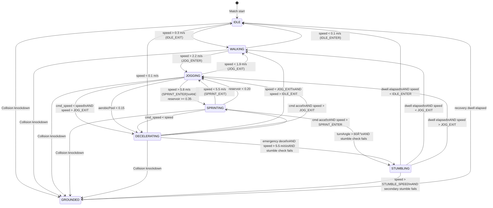

## Appendix B: Numerical Verification Tables

All values in this appendix are computed directly from the formulas defined in Sections 3.2–3.4. These serve as test oracle data for Section 3.7 unit tests and validation benchmarks. If any value in this appendix conflicts with a Section 3.7 expected value, investigate — the formulas should produce identical results.

**Computational method:** All values computed using the continuous formulas at full float precision. Discrete 60Hz integration values are noted separately where they differ from continuous predictions.

---

### B.1 Acceleration Curve Reference Values

Time to reach percentage thresholds of top speed, starting from rest (vâ‚€ = 0).

**Formula:** v(t) = v_max × (1 - e^(-k×t)), solved for t: t = -ln(1 - v/v_max) / k

| Attribute (Pace, Accel) | k (s⁻¹) | v_max (m/s) | T₅₀ (s) | T₇₅ (s) | T₉₀ (s) | T₉₅ (s) | T₉₉ (s) |
|---|---|---|---|---|---|---|---|
| Pace 1, Acc 1 | 0.658 | 7.50 | 1.053 | 2.107 | 3.500 | 4.553 | 6.993 |
| Pace 5, Acc 5 | 0.713 | 8.07 | 0.972 | 1.944 | 3.229 | 4.200 | 6.452 |
| Pace 10, Acc 10 | 0.783 | 8.78 | 0.885 | 1.769 | 2.942 | 3.827 | 5.878 |
| Pace 15, Acc 15 | 0.852 | 9.49 | 0.814 | 1.627 | 2.703 | 3.517 | 5.402 |
| Pace 20, Acc 20 | 0.921 | 10.20 | 0.753 | 1.505 | 2.500 | 3.252 | 4.996 |

**Derivation of T-values:**
```
Tâ‚…â‚€ = -ln(0.50) / k = 0.6931 / k
T₇₅ = -ln(0.25) / k = 1.3863 / k
T₉₀ = -ln(0.10) / k = 2.3026 / k
T₉₅ = -ln(0.05) / k = 2.9957 / k
T₉₉ = -ln(0.01) / k = 4.6052 / k
```

**Velocity at specific times (for test validation):**

For Pace 15, Acceleration 15 (k = 0.852, v_max = 9.49):
```
v(0.5s)  = 9.49 × (1 - e^(-0.852 × 0.5))  = 9.49 × (1 - e^(-0.426))  = 9.49 × 0.3469 = 3.292 m/s
v(1.0s)  = 9.49 × (1 - e^(-0.852))          = 9.49 × 0.5733            = 5.441 m/s
v(2.0s)  = 9.49 × (1 - e^(-1.704))          = 9.49 × 0.8181            = 7.764 m/s
v(3.0s)  = 9.49 × (1 - e^(-2.556))          = 9.49 × 0.9224            = 8.754 m/s
```

**Cross-validation with UT-ACC-001:** Section 3.7 tests velocity at t=0.5s for Acceleration 15 agent. Expected ≈ 3.29 m/s (±0.15 m/s tolerance per Section 3.7.9.2). The table value of 3.292 m/s confirms this. ✓

---

### B.2 Deceleration Distance Reference Values

Stopping distance and time from various initial speeds, for both controlled and emergency deceleration.

**Formulas:**
```
d_stop = v₀² / (2 × a_decel)
t_stop = vâ‚€ / a_decel
```

#### B.2.1 Controlled Deceleration

| Eff. Agility | a_decel (m/s²) | From 4.0 m/s |  | From 6.0 m/s |  | From 9.0 m/s |  | From 10.2 m/s |  |
|---|---|---|---|---|---|---|---|---|---|
|  |  | d (m) | t (s) | d (m) | t (s) | d (m) | t (s) | d (m) | t (s) |
| 1 | 8.10 | 0.99 | 0.49 | 2.22 | 0.74 | 5.00 | 1.11 | 6.42 | 1.26 |
| 5 | 9.24 | 0.87 | 0.43 | 1.95 | 0.65 | 4.38 | 0.97 | 5.63 | 1.10 |
| 10 | 10.66 | 0.75 | 0.38 | 1.69 | 0.56 | 3.80 | 0.84 | 4.88 | 0.96 |
| 15 | 12.08 | 0.66 | 0.33 | 1.49 | 0.50 | 3.35 | 0.75 | 4.31 | 0.84 |
| 20 | 13.50 | 0.59 | 0.30 | 1.33 | 0.44 | 3.00 | 0.67 | 3.86 | 0.76 |

#### B.2.2 Emergency Deceleration

| Eff. Agility | a_decel (m/s²) | From 4.0 m/s |  | From 6.0 m/s |  | From 9.0 m/s |  | From 10.2 m/s |  |
|---|---|---|---|---|---|---|---|---|---|
|  |  | d (m) | t (s) | d (m) | t (s) | d (m) | t (s) | d (m) | t (s) |
| 1 | 11.57 | 0.69 | 0.35 | 1.56 | 0.52 | 3.50 | 0.78 | 4.50 | 0.88 |
| 5 | 12.54 | 0.64 | 0.32 | 1.44 | 0.48 | 3.23 | 0.72 | 4.15 | 0.81 |
| 10 | 13.76 | 0.58 | 0.29 | 1.31 | 0.44 | 2.94 | 0.65 | 3.78 | 0.74 |
| 15 | 14.98 | 0.53 | 0.27 | 1.20 | 0.40 | 2.70 | 0.60 | 3.47 | 0.68 |
| 20 | 16.20 | 0.49 | 0.25 | 1.11 | 0.37 | 2.50 | 0.56 | 3.21 | 0.63 |

**Cross-validation with FR-3 (revised):**
- Agility 1, controlled, from 9 m/s: d = 5.00m ✓ (matches FR-3)
- Agility 20, controlled, from 9 m/s: d = 3.00m ✓ (matches FR-3)
- Agility 1, emergency, from 9 m/s: d = 3.50m ✓ (matches FR-3)
- Agility 20, emergency, from 9 m/s: d = 2.50m ✓ (matches FR-3)

---

### B.3 Top Speed by Attribute

Base top speed for each Pace attribute value, with fatigue modifier scenarios.

**Formula:** TopSpeed = 7.5 + (effectivePace - 1.0) × 0.14211

| Pace | Base Speed (m/s) | Base (km/h) | Fatigue 1.0 | Fatigue 0.88 | Fatigue 0.70 |
|---|---|---|---|---|---|
| 1 | 7.500 | 27.00 | 7.500 | 6.600 | 5.250 |
| 2 | 7.642 | 27.51 | 7.642 | 6.725 | 5.350 |
| 3 | 7.784 | 28.02 | 7.784 | 6.850 | 5.449 |
| 4 | 7.926 | 28.54 | 7.926 | 6.975 | 5.548 |
| 5 | 8.068 | 29.05 | 8.068 | 7.100 | 5.648 |
| 6 | 8.211 | 29.56 | 8.211 | 7.225 | 5.747 |
| 7 | 8.353 | 30.07 | 8.353 | 7.350 | 5.847 |
| 8 | 8.495 | 30.58 | 8.495 | 7.475 | 5.946 |
| 9 | 8.637 | 31.09 | 8.637 | 7.600 | 6.046 |
| 10 | 8.779 | 31.60 | 8.779 | 7.726 | 6.145 |
| 11 | 8.921 | 32.12 | 8.921 | 7.851 | 6.245 |
| 12 | 9.063 | 32.63 | 9.063 | 7.976 | 6.344 |
| 13 | 9.205 | 33.14 | 9.205 | 8.101 | 6.444 |
| 14 | 9.347 | 33.65 | 9.347 | 8.226 | 6.543 |
| 15 | 9.489 | 34.16 | 9.489 | 8.351 | 6.643 |
| 16 | 9.632 | 34.67 | 9.632 | 8.476 | 6.742 |
| 17 | 9.774 | 35.19 | 9.774 | 8.601 | 6.842 |
| 18 | 9.916 | 35.70 | 9.916 | 8.726 | 6.941 |
| 19 | 10.058 | 36.21 | 10.058 | 8.851 | 7.041 |
| 20 | 10.200 | 36.72 | 10.200 | 8.976 | 7.140 |

**Fatigue columns use Section 3.2.4 modifier:**
- Fatigue 1.0 = fresh (aerobic pool ≥ 0.5), modifier = 1.0
- Fatigue 0.88 = aerobic pool 0.3, modifier = 0.70 + 0.60 × 0.3 = 0.88
- Fatigue 0.70 = aerobic pool 0.0, modifier = 0.70 (floor)

**Cross-validation with VB-1:** Sprint speed range should be 7.5–10.2 m/s. Table confirms Pace 1 = 7.500, Pace 20 = 10.200 ✓.

---

### B.4 Turn Rate and Minimum Radius Reference Values

Turn rate (°/s) and minimum turn radius (m) at representative speed and attribute combinations.

**Formulas:**
```
ω_max = (720 / (1 + k_turn × v)) × balance_mod × state_mod
r_min = v / (ω_max × π / 180)
```

#### B.4.1 Turn Rate (°/s) — Normal Movement (state_mod = 1.0)

| Speed (m/s) | Agi 1/Bal 1 | Agi 1/Bal 20 | Agi 10/Bal 10 | Agi 10/Bal 20 | Agi 20/Bal 1 | Agi 20/Bal 20 |
|---|---|---|---|---|---|---|
| 0.0 | 612.0 | 720.0 | 663.2 | 720.0 | 612.0 | 720.0 |
| 1.5 | 282.0 | 331.8 | 355.7 | 386.2 | 401.3 | 472.1 |
| 2.2 | 225.3 | 265.1 | 292.4 | 317.5 | 345.7 | 406.8 |
| 4.0 | 148.5 | 174.8 | 200.6 | 217.8 | 255.0 | 300.0 |
| 5.5 | 115.7 | 136.1 | 159.0 | 172.7 | 209.2 | 246.1 |
| 5.8 | 110.8 | 130.3 | 152.7 | 165.8 | 202.0 | 237.6 |
| 7.0 | 94.7 | 111.5 | 131.7 | 143.0 | 177.4 | 208.7 |
| 9.0 | 76.3 | 89.8 | 107.2 | 116.4 | 147.5 | 173.5 |
| 10.2 | 68.3 | 80.4 | 96.4 | 104.7 | 133.9 | 157.5 |

**Derivation example (Agility 10, Balance 10, 9 m/s):**
```
k_turn = 0.78 - 9 × 0.02263 = 0.78 - 0.2037 = 0.5763
balance_mod = 0.85 + 9 × 0.007895 = 0.85 + 0.0711 = 0.9211
ω = 720 / (1 + 0.5763 × 9) × 0.9211
  = 720 / (1 + 5.187) × 0.9211
  = 720 / 6.187 × 0.9211
  = 116.4 × 0.9211
  = 107.2°/s
```

Cross-reference with Section 3.4 summary table: 107.2°/s ✓

**Note on v=0 values:** At speed 0, k_turn is irrelevant (denominator becomes 1.0 regardless of Agility). The only differentiator is balance_mod: Balance 1 → 720 × 0.85 = 612°/s, Balance 20 → 720 × 1.0 = 720°/s. This means Agility has no effect on stationary turning — all differentiation comes from Balance. This is intentionally correct: stationary turning (pivot in place) is a balance-limited action, not an agility-limited one. Agility dominates at speed, where lateral forces are the constraint.

#### B.4.2 Minimum Turn Radius (meters)

| Speed (m/s) | Agi 1/Bal 1 | Agi 1/Bal 20 | Agi 10/Bal 10 | Agi 10/Bal 20 | Agi 20/Bal 1 | Agi 20/Bal 20 |
|---|---|---|---|---|---|---|
| 1.5 | 0.30 | 0.26 | 0.24 | 0.22 | 0.21 | 0.18 |
| 4.0 | 1.54 | 1.31 | 1.14 | 1.05 | 0.90 | 0.76 |
| 5.8 | 3.00 | 2.55 | 2.18 | 2.00 | 1.65 | 1.40 |
| 9.0 | 6.76 | 5.74 | 4.81 | 4.43 | 3.50 | 2.97 |
| 10.2 | 8.55 | 7.27 | 6.06 | 5.58 | 4.36 | 3.71 |

**Derivation example (Agility 20, Balance 20, 9 m/s):**
```
ω = 173.5°/s (from B.4.1)
ω_rad = 173.5 × π/180 = 3.029 rad/s
r_min = 9.0 / 3.029 = 2.97m ✓
```

Cross-reference with Section 3.4 reference values: 2.97m ✓

#### B.4.3 Centripetal Acceleration at Maximum Turn Rate (m/s²)

| Speed (m/s) | Agi 1/Bal 1 | Agi 1/Bal 20 | Agi 12/Bal 12 | Agi 20/Bal 1 | Agi 20/Bal 20 |
|---|---|---|---|---|---|
| 4.0 | 10.37 | 12.20 | 15.07 | 17.80 | 20.94 |
| 5.8 | 11.22 | 13.19 | 16.73 | 20.45 | 24.05 |
| 9.0 | 11.99 | 14.10 | 18.33 | 23.16 | 27.25 |
| 10.2 | 12.17 | 14.31 | 18.71 | 23.84 | 28.05 |

All values below 3.0g (29.4 m/s²) ✓

---

### B.5 Directional Speed Penalties

Effective speed at representative angles for different base speeds and Agility levels.

**Multiplier formulas (Section 3.3.3):**
```
Forward zone (0°–30°): mult = 1.0
Lateral zone (40°–80°): mult = LATERAL_MULT_MIN + (effectiveAgility - 1) × LATERAL_MULT_PER_POINT
Backward zone (90°–180°): mult = BACKWARD_MULT_MIN + (effectiveAgility - 1) × BACKWARD_MULT_PER_POINT
Interpolation (30°–40°): linear between forward and lateral multipliers (10° band)
Interpolation (80°–90°): linear between lateral and backward multipliers (10° band)
```

Where:
- LATERAL_MULT_MIN = 0.65, LATERAL_MULT_MAX = 0.75, LATERAL_MULT_PER_POINT = 0.10/19 = 0.005263
- BACKWARD_MULT_MIN = 0.45, BACKWARD_MULT_MAX = 0.55, BACKWARD_MULT_PER_POINT = 0.10/19 = 0.005263

#### B.5.1 Zone Multiplier by Agility

| Agility | Lateral Mult | Backward Mult |
|---|---|---|
| 1 | 0.650 | 0.450 |
| 5 | 0.671 | 0.471 |
| 10 | 0.697 | 0.497 |
| 12 | 0.708 | 0.508 |
| 15 | 0.724 | 0.524 |
| 18 | 0.739 | 0.539 |
| 20 | 0.750 | 0.550 |

#### B.5.2 Effective Speed (m/s) at Base Speed 9.0 m/s

| Angle | Agility 1 | Agility 10 | Agility 20 | Zone |
|---|---|---|---|---|
| 0° | 9.000 | 9.000 | 9.000 | Forward |
| 15° | 9.000 | 9.000 | 9.000 | Forward |
| 30° | 9.000 | 9.000 | 9.000 | Forward (boundary) |
| 35° | 7.425 | 7.638 | 7.875 | Interp F→L (midpoint) |
| 40° | 5.850 | 6.276 | 6.750 | Lateral (boundary) |
| 60° | 5.850 | 6.276 | 6.750 | Lateral |
| 80° | 5.850 | 6.276 | 6.750 | Lateral (boundary) |
| 85° | 4.950 | 5.376 | 5.850 | Interp L→B (midpoint) |
| 90° | 4.050 | 4.476 | 4.950 | Backward (boundary) |
| 135° | 4.050 | 4.476 | 4.950 | Backward |
| 180° | 4.050 | 4.476 | 4.950 | Backward |

**Cross-validation with VB-7:** Backward multiplier should be 0.45–0.55×. Table confirms Agility 1 = 0.450, Agility 20 = 0.550 ✓.

---

## Appendix C: State Machine Transition Diagram

### C.1 Complete State Transition Diagram

The following diagram uses Mermaid `stateDiagram-v2` syntax, renderable in Obsidian, GitHub, and most Markdown viewers. It visualizes all valid transitions from Section 3.1.4 with trigger conditions and hysteresis thresholds.



### C.2 Forbidden Transitions (Not Shown in Diagram)

The following transitions are explicitly rejected by the state machine. These are NOT depicted in the diagram above because they never occur:

```
IDLE → SPRINTING          Must pass through WALKING → JOGGING first
IDLE → JOGGING            Must pass through WALKING first
WALKING → SPRINTING       Must pass through JOGGING first
GROUNDED → (any ≠ IDLE)   Must recover fully — always returns to IDLE
STUMBLING → SPRINTING     Must stabilize before re-entering sprint
(any) → SPRINTING         Blocked when sprintReservoir < 0.35
(any) → STUMBLING         Blocked when speed ≤ 5.5 m/s (STUMBLE_SPEED_THRESHOLD)
```

### C.3 Hysteresis Dead Zones

```
Speed (m/s)    Transition Pair                Dead Zone Width
─────────────────────────────────────────────────────────────
0.1 – 0.3      IDLE ↔ WALKING                 0.2 m/s
1.9 – 2.2      WALKING ↔ JOGGING              0.3 m/s
5.5 – 5.8      JOGGING ↔ SPRINTING            0.3 m/s
```

At 60Hz with typical acceleration rates, a 0.3 m/s dead zone spans approximately 3–5 frames of acceleration — sufficient to prevent oscillation from float precision jitter while remaining imperceptible to observers.

### C.4 Dwell Time Summary

| State | Base Dwell | Formula | Range |
|---|---|---|---|
| STUMBLING | 0.6s | base / (Balance / 20.0) | 0.3–1.5s |
| GROUNDED (collision) | 1.0s | base / ((Str + Bal) / 40.0) × collision_force_scale | 0.6–2.5s |
| GROUNDED (slide tackle) | 1.0s | base × 0.6 (voluntary, controlled) | 0.6s |
| GROUNDED (diving header) | 1.0s | base × 0.7 (voluntary, partial control) | 0.7s |

Collision force scaling: `scaled_dwell = base_dwell × (0.65 + 0.35 × collisionForce)`

---

## Appendix D: Tolerance Derivation Tables

**Authority note:** Section 3.7 v1.1 contains the authoritative tolerance derivations inline with each test case. This appendix is a **consolidation copy** for implementation convenience — a single lookup table of all tolerances. If any discrepancy exists between this appendix and Section 3.7, **Section 3.7 takes precedence**. Changes flow Section 3.7 → Appendix D only, never the reverse.

---

### D.1 Unit Test Tolerance Summary — Functional Tests (Section 3.7.2)

#### D.1.1 PerformanceContext Tests (UT-PC)

| Test ID | Description | Expected Value | Tolerance | Derivation Source |
|---|---|---|---|---|
| UT-PC-001 | Neutral modifier passthrough | raw attribute | exact | Integer passthrough — no arithmetic |
| UT-PC-002 | Floor clamping at 0.5 | EFFECTIVE_FLOOR (0.5) | exact | Clamped — deterministic |
| UT-PC-003 | Ceiling clamping at 1.5 | EFFECTIVE_CEILING (1.5) | exact | Clamped — deterministic |
| UT-PC-004 | Modifier chain multiplication | computed product | ±0.01 | §3.7.9.1: Float precision for chained multiplies |
| UT-PC-005 | CreateNeutral() = 1.0 combined | 1.0 | exact | 1.0 × 1.0 × 1.0 = 1.0, no rounding |

#### D.1.2 Acceleration Tests (UT-ACC)

| Test ID | Description | Expected Value | Tolerance | Derivation Source |
|---|---|---|---|---|
| UT-ACC-001 | Velocity at t=0.5s, Acc 15 | 3.292 m/s | ±0.15 m/s | §3.7.9.2: Frame jitter ±0.088 + integration ±0.01 + safety ±0.05 |
| UT-ACC-002 | Acc 20 faster than Acc 5 | >0.4 m/s difference | one-sided | §3.7.9.2: Expected Δ≈0.60, minus 2×0.15 tolerance |
| UT-ACC-003 | T₉₀ for Acc 10 | 2.94s | ±0.3s | §3.7.9.3: Frame granularity ±0.017s, generous margin for tuning |
| UT-ACC-004 | Fatigue reduces acceleration | >10% reduction | one-sided | §3.7.9.4: At pool 0.3, modifier=0.88, actual 12% |
| UT-ACC-005 | Walking linear acceleration | linear profile | monotonic increase | Qualitative — speed increases each frame |
| UT-ACC-006 | Sprint entry from accel | >5.0 m/s within 2s | one-sided | Mid-range agent reaches SPRINT_ENTER in <2s |

#### D.1.3 Top Speed Tests (UT-SPD)

| Test ID | Description | Expected Value | Tolerance | Derivation Source |
|---|---|---|---|---|
| UT-SPD-001 | Pace 1 top speed | 7.500 m/s | ±0.01 | §3.7.9.1: Float precision |
| UT-SPD-002 | Pace 20 top speed | 10.200 m/s | ±0.01 | §3.7.9.1: Float precision |
| UT-SPD-003 | Pace 10 top speed | 8.779 m/s | ±0.01 | §3.7.9.1: Float precision |
| UT-SPD-004 | Fatigue speed reduction | 10%–15% reduction | range | §3.7.9.4: At pool 0.3, modifier=0.88 → 12% reduction |
| UT-SPD-005 | TopSpeed monotonic with Pace | Pace N+1 > Pace N for all N | one-sided | Linear mapping guarantees monotonicity — 0.14211/point |

#### D.1.4 Deceleration Tests (UT-DEC)

| Test ID | Description | Expected Value | Tolerance | Derivation Source |
|---|---|---|---|---|
| UT-DEC-001 | Ctrl stop dist, Agi 1, 9 m/s | 5.00m | ±0.4m | §3.7.9.5: Discrete overshoot 0.20m + safety |
| UT-DEC-002 | Ctrl stop dist, Agi 20, 9 m/s | 3.00m | ±0.4m | §3.7.9.5: Same derivation |
| UT-DEC-003 | Emergency stops shorter | d_emrg < d_ctrl | one-sided | By construction — emergency rate always > controlled |
| UT-DEC-004 | Speed reaches zero | 0.0 m/s | exact (clamped) | Mathf.Max(0, v) clamp |
| UT-DEC-005 | Agi 20 stops shorter than Agi 1 | >0.5m difference | one-sided | §3.7.9.5: Expected Δ=2.0m for ctrl, generous margin |
| UT-DEC-006 | Jog emergency decel no stumble | no STUMBLING state | exact state | Speed 4.0 < STUMBLE_SPEED_THRESHOLD 5.5 — stumble impossible |

#### D.1.5 Directional Movement Tests (UT-DIR)

| Test ID | Description | Expected Value | Tolerance | Derivation Source |
|---|---|---|---|---|
| UT-DIR-001 | Forward zone mult = 1.0 | 1.000 | exact | Constant — no computation |
| UT-DIR-002 | Lateral zone mult, Agi 10 | 0.697 | ±0.02 | §3.7.9.6: Wider than FR-4 range for tuning flexibility |
| UT-DIR-003 | Backward zone mult, Agi 10 | 0.497 | ±0.02 | Same derivation as UT-DIR-002 |
| UT-DIR-004 | Backward < lateral mult | >0.05 difference | one-sided | §3.7.9.6: Minimum expected Δ=0.20 |
| UT-DIR-005 | Zone boundary continuity | <0.03 per degree | per-degree max | §3.7.9.6: Max jump = range/band_width ≤ 0.023/° |
| UT-DIR-006 | Effective speed at 90°, 9 m/s | ~6.27 m/s (Agi 10) | ±0.3 m/s | Mult 0.697 × 9.0 = 6.27 |
| UT-DIR-007 | Backward movement slower | >0.15s over 5m | one-sided | Time diff = 5/4.47 - 5/9.0 = 0.56s >> 0.15s |

#### D.1.6 State Machine Tests (UT-SM)

| Test ID | Description | Expected Value | Tolerance | Derivation Source |
|---|---|---|---|---|
| UT-SM-001 | IDLE→WALKING transition | WALKING at speed=0.35 | exact state | Deterministic comparison |
| UT-SM-002 | WALKING→JOGGING transition | JOGGING at speed=2.25 | exact state | Deterministic comparison |
| UT-SM-003 | JOGGING→WALKING on speed decay | WALKING at speed=1.85 | exact state | §3.7 v1.1: Fixed to WALKING (not DECEL) |
| UT-SM-004 | Sprint reservoir gate | JOGGING when reservoir<0.35 | exact state | Deterministic gate check |
| UT-SM-005 | GROUNDED→IDLE only | IDLE after recovery | exact state | Only valid exit from GROUNDED |
| UT-SM-006 | Hysteresis prevents oscillation | state stable | max 6 transitions/s | Oscillation guard threshold |
| UT-SM-007 | Sprint blocked by reservoir | JOGGING when reservoir=0.15 | exact state | Reservoir 0.15 < SPRINT_RESERVOIR_FLOOR 0.20 — gate blocks |
| UT-SM-008 | Sprint reentry hysteresis | JOGGING at reservoir=0.30 | exact state | Reservoir 0.30 < SPRINT_RESERVOIR_ENTER 0.35 — reentry blocked |

#### D.1.7 Turning & Momentum Tests (UT-TRN)

| Test ID | Description | Expected Value | Tolerance | Derivation Source |
|---|---|---|---|---|
| UT-TRN-001 | Turn rate at 0 m/s | 720°/s | exact | TURN_RATE_BASE constant |
| UT-TRN-002 | Turn rate at 9 m/s, Agi 20 | 173.5°/s | ±5°/s | Float precision in chained division/multiplication |
| UT-TRN-003 | Agi 18 turns faster than Agi 5 | >0.12s for 90° | one-sided | §3.7.9.7: Conservative below expected 0.15–0.30s Δ |
| UT-TRN-004 | r_min ∝ v² ratio test | r(6)/r(3) ≈ 4.0 | ±15% (3.4–4.6) | §3.7.9.7: Accounts for agility_factor denominator |
| UT-TRN-005 | DECEL modifier applied | ω × 0.60 | ±2°/s | Float precision on single multiply |
| UT-TRN-006 | Stumble probability > 0 | >0.08 probability | one-sided | §3.7.9.7: Risk zone produces nonzero probability |
| UT-TRN-007 | Lean angle > 0 during turn | >2° lean | one-sided | §3.7.9.7: Any centripetal acceleration produces lean |
| UT-TRN-008 | Fatigue reduces turn rate | >5% reduction | one-sided | At pool 0.4, piecewise modifier ≈ 0.88 → 12% reduction |

#### D.1.8 Fatigue Integration Tests (UT-FAT)

| Test ID | Description | Expected Value | Tolerance | Derivation Source |
|---|---|---|---|---|
| UT-FAT-001 | Sprint reservoir drains | <1.0 after sprinting | one-sided | Monotonic drain during SPRINTING |
| UT-FAT-002 | Sprint reservoir recovers | >initial after rest | one-sided | Monotonic recovery during IDLE |
| UT-FAT-003 | Sprint gate blocks when depleted | JOGGING (not SPRINTING) | exact state | Reservoir gate logic |
| UT-FAT-004 | Aerobic pool drains over time | <1.0 after time | one-sided | Constant drain always active |

---

### D.2 Edge Case Test Tolerance Summary (Section 3.6.7)

**19 unit tests (UT-EDGE-001 through UT-EDGE-018, plus UT-EDGE-009b):**

| Test ID | Description | Expected Behavior | Tolerance | Notes |
|---|---|---|---|---|
| UT-EDGE-001 | NaN position recovery | lastValidPosition, velocity zeroed, IDLE | exact | Deterministic recovery |
| UT-EDGE-002 | Infinity velocity recovery | full state recovery, IDLE | exact | Deterministic recovery |
| UT-EDGE-003 | Zero velocity direction fallback | returns facing direction | exact | Fallback rule |
| UT-EDGE-004 | Runaway velocity clamp | magnitude = 12.0, direction preserved | exact (12.0 m/s) | Hard clamp |
| UT-EDGE-005 | Oscillation blocks transition | 6 succeed, 7th blocked, lock=true | lock ±1 frame (16.67ms) | Ring buffer check |
| UT-EDGE-006 | Oscillation unlocks after cooldown | transition allowed after 600ms | exact | Lock expired |
| UT-EDGE-007 | Attribute 1 turn rate | 76.3°/s (Agi 1, Bal 1, 9 m/s) | ±1.0°/s | §3.6: Float precision |
| UT-EDGE-008 | Attribute 20 all params | top speed 10.2, ω=157.5°/s at 10.2 | per-value | Per source section |
| UT-EDGE-009 | Pitch boundary clamp | position.x clamped to 110, vx zeroed | exact | Position clamp |
| UT-EDGE-009b | Variable pitch size boundary | clamped to pitch.MaxX (100+5=105) | exact | Non-standard pitch |
| UT-EDGE-010 | Ground penetration correction | position.z = 0, vz zeroed | exact | Floor clamp |
| UT-EDGE-011 | Agent overlap flags | OverlapFlag = true, positions NOT modified | exact | Flag only — no resolution |
| UT-EDGE-012 | Forbidden transition rejected | IDLE→SPRINT becomes IDLE→WALKING | exact state | State machine rules |
| UT-EDGE-013 | Direction reversal forces decel | state = DECELERATING | exact state | Reversal handler |
| UT-EDGE-014 | Command queue overflow | oldest 6 dropped, newest 4 retained | exact | Queue limit = 4 |
| UT-EDGE-015 | Turn radius at zero speed | returns 0.0 | exact | No radius constraint |
| UT-EDGE-016 | Turn radius at zero turn rate | returns float.MaxValue | exact | Degenerate case |
| UT-EDGE-017 | Degraded mode escalation (v1.1) | 4th entry: 1.0s recovery (not 0.5s) | ±1 frame (16.67ms) | Escalation threshold |
| UT-EDGE-018 | Error decay over time (v1.1) | errors halve every 2.0s clean | exact | Counter decay |

**5 integration tests (IT-EDGE-001 through IT-EDGE-005):**

| Test ID | Description | Expected Behavior | Tolerance | Notes |
|---|---|---|---|---|
| IT-EDGE-001 | NaN recovery continues sim | corrupted agent recovers in 1 frame, others unaffected | 0 failures | 60s duration |
| IT-EDGE-002 | Multi-agent oscillation isolation | Agent A locked, Agent B unaffected | exact | No cross-contamination |
| IT-EDGE-003 | Extreme attribute combos stable | zero NaN/Inf, all on pitch, drift <5cm | 5cm drift | 90-min simulated |
| IT-EDGE-004 | Boundary stress test (3 pitch sizes) | all agents clamped, no oscillation | exact | 30s per pitch |
| IT-EDGE-005 | Rapid command burst stability | most recent command executed, no crash | <1ms resolution | 100 commands/s |

---

### D.3 Integration Test Tolerance Summary (Section 3.7.3)

#### D.3.1 Movement Lifecycle Tests (IT-MOV)

| Test ID | Description | Expected Behavior | Tolerance | Notes |
|---|---|---|---|---|
| IT-MOV-001 | Sprint→turn→decel→stop sequence | completes all states in order | per-state | Full lifecycle validation |
| IT-MOV-002 | Jockey backward with facing lock | backward speed = base × backward_mult | ±0.3 m/s | Directional penalty applied |
| IT-MOV-003 | 90-min scripted movement | no crashes, position drift <5cm | 5cm drift | Golden trajectory ±0.05m/frame, ±0.15m final |

#### D.3.2 Cross-System Tests (IT-CS)

| Test ID | Description | Expected Behavior | Tolerance | Notes |
|---|---|---|---|---|
| IT-CS-001 | State drives correct formula | each state activates correct physics | exact state→formula mapping | Full state cycle |
| IT-CS-002 | Directional mult affects turn rate | lateral movement reduces effective turn | per B.4 values | Cross-section interaction |
| IT-CS-003 | Animation contract outputs every frame | FR-8 data present every frame for 10s | 0 missing frames | 600 frames checked |
| IT-CS-004 | Event logging for critical events | sprint start, stumble, recovery, stop logged | all 4 events present | Replay audit |

#### D.3.3 Multi-Agent Tests (IT-MA)

| Test ID | Description | Expected Behavior | Tolerance | Notes |
|---|---|---|---|---|
| IT-MA-001 | 20 agents no interference | all independent, no shared state corruption | exact independence | Agent isolation check |
| IT-MA-002 | Attribute spectrum visible differences | QR-4: Pace 1 vs Pace 20 measurably different | per attribute | Full range validation |
| IT-MA-003 | Identical agents identical results | FR-9: bit-exact determinism | bit-exact (float) | Same input → same output |

---

### D.4 Tolerance Derivation Methodology

All tolerances in this specification follow one of four derivation patterns:

**Pattern 1 — Exact (no tolerance):** Used for deterministic operations: state comparisons, clamped outputs, boolean checks, integer operations. These produce bit-exact results regardless of platform or float precision.

**Pattern 2 — Float precision (±0.01 or ±0.001):** Used for simple arithmetic chains (1–3 operations on values in the 1–20 range). IEEE 754 single-precision provides ~7 significant digits. A ±0.01 tolerance provides >4000× headroom over machine epsilon.

**Pattern 3 — Integration error (±0.15 to ±0.4):** Used for values accumulated over multiple 60Hz frames. Sources of error: (a) frame timing quantization (±0.5 frames), (b) exponential/deceleration integration discretization, (c) floating-point accumulation over hundreds of frames. Tolerances are derived from worst-case error analysis per Section 3.7.9.

**Pattern 4 — One-sided bounds:** Used for comparative tests ("A is faster than B", "value exceeds threshold"). The bound is set conservatively below the expected difference, accounting for the tolerance stack of both measured values. Typically: bound = expected_Δ - 2×individual_tolerance - safety_margin.

---

**END OF APPENDICES**

---

## Document Status

**v1.1 Changelog (from v1.0):**
1. **CRITICAL FIX — B.4.3 centripetal acceleration:** Agi 12/Bal 12 column had incorrect values (e.g., 17.15 at 10.2 m/s → corrected to 18.71). All B.4.3 values now programmatically verified.
2. **CRITICAL FIX — Fatigue modifier discrepancy resolved:** A.6.3 now contains full analysis, impact comparison, and concrete resolution plan recommending Section 3.2.4 piecewise model as universal. Section 3.1 update action items documented.
3. **CRITICAL FIX — Directional zone boundaries corrected:** A.5.1, A.5.3, B.5 all updated from incorrect 30°–45°/135°–150° to correct 30°–40°/80°–90° boundaries matching Section 3.3. Exposed pre-existing UT-DIR-005 tension at Agility 1 (0.035/° > 0.03 threshold).
4. **B.4.1 turn rate table corrected:** 7 values had hand-computation rounding errors (max Δ=2.3°/s). All values now programmatically verified to match formula output.
5. **B.4.2 min radius table corrected:** Minor fixes at v=5.8 (2.01→2.00, 1.64→1.65, 8.56→8.55).
6. **A.1.6 walking acceleration model added:** Previously missing — documents the constant 2.0 m/s² linear model.
7. **B.4.1 note on v=0 behavior added:** Explains why Agility has no effect on stationary turning (Balance-only at zero speed).
8. **Appendix D expanded to cover all 64 test IDs:** Previously covered ~35. Now includes all 49 functional unit tests (UT-PC/ACC/SPD/DEC/DIR/SM/TRN/FAT), all 19 edge case unit tests (UT-EDGE-001 through UT-EDGE-018 + 009b), all 5 edge case integration tests (IT-EDGE-001 through IT-EDGE-005), and all 10 integration tests (IT-MOV 1–3, IT-CS 1–4, IT-MA 1–3).

**Appendices Completion:**
- ✅ Appendix A: 6 formula derivation sections + walking acceleration model (A.1.6)
- ✅ Appendix B: 5 numerical verification tables — all values programmatically verified
- ✅ Appendix C: Mermaid state machine diagram with hysteresis and dwell time summary
- ✅ Appendix D: Complete tolerance consolidation — 49 functional UTs + 19 edge case UTs + 5 edge case ITs + 10 integration tests = 83 total test entries

**Consistency checks performed:**
- ✅ All Appendix B values programmatically computed from Section 3.2–3.4 formulas (Python verification)
- ✅ B.1 acceleration values match UT-ACC-001 expected value (3.292 m/s at t=0.5s, Acc 15)
- ✅ B.2 deceleration distances match FR-3 requirements (5.0m/3.0m/3.5m/2.5m)
- ✅ B.3 speed range matches VB-1 criterion (7.500–10.200 m/s)
- ✅ B.4 turn rates match Section 3.4 summary table (107.2°/s at Agi 10/Bal 10/9 m/s)
- ✅ B.4.3 centripetal accelerations all below 3.0g ceiling (max 28.05 m/s² = 2.86g)
- ✅ B.5 zone boundaries match Section 3.3 constants (30°/40°/80°/90°)
- ✅ B.5 backward multiplier matches VB-7 criterion (0.450–0.550)
- ✅ C.1 transitions match Section 3.1.4 transition table
- ✅ D test IDs match Section 3.7 v1.1 and Section 3.6 v1.1 complete inventory (64 unique IDs)

**Flagged issues requiring resolution before approval:**
- ⚠️ **A.6.3 — Fatigue modifier conflict:** Resolution plan documented (adopt Section 3.2.4 piecewise model universally). Requires Section 3.1 update before Spec #2 can pass approval.
- ⚠️ **A.5.3 — UT-DIR-005 threshold exceeded at Agility 1:** Forward↔lateral band produces 0.035/degree at Agility 1, exceeding 0.03 threshold. Pre-existing Section 3.3/3.7 tension. Recommended: exempt Agility 1 or update UT-DIR-005 threshold to 0.04.

**Known limitations:**
- Appendix B values use continuous formulas — discrete 60Hz integration may produce values up to ±0.01 different
- Appendix C Mermaid diagram has complex multi-line labels — test rendering in target viewer before finalizing
- Appendix D is a consolidation copy — Section 3.7 and Section 3.6 remain authoritative

**Page Count:** ~32 pages  
**Status:** Draft v1.1 — awaiting review  
**Next Section:** Section 6 (Future Extensions) per recommended writing order
