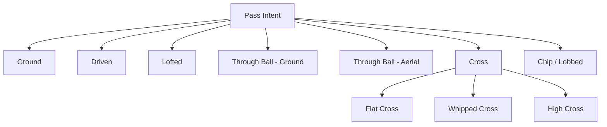

# Pass Mechanics Specification #5 — Detailed Outline

**Purpose:** Planning document for Pass Mechanics specification, establishing scope, structure, mathematical framework, and technical approach before full section drafting begins. This document defines what will be written, not yet how it will be implemented in detail.

**Created:** February 19, 2026, 12:00 PM PST  
**Version:** 1.0  
**Status:** Awaiting Approval  
**Specification Number:** 5 of 20 (Stage 0)  
**Estimated Effort:** ~35 hours (larger than First Touch due to pass type taxonomy complexity)  
**Dependencies:** Ball Physics (#1), Agent Movement (#2), Collision System (#3), First Touch (#4)

---

## EXECUTIVE SUMMARY

Pass Mechanics governs the initiation and execution of all passes — the moment an agent decides to play the ball to another location and the physics of that kick are applied. This is the most frequently executed action in any football match; every passing event flows through this system.

The core responsibility of this specification is narrow but critical: **translate a pass intent into a ball state**. Everything before (the decision to pass) is owned by Decision Tree (#8). Everything after (the ball's flight) is owned by Ball Physics (#1). Everything on the receiving end is owned by First Touch (#4).

**Core model:**
```
PassResult = PassType × (Velocity, Spin, LaunchAngle) × ErrorVector
```

Where:
- `PassType` determines the physical profile (trajectory shape, spin characteristics)
- `Velocity`, `Spin`, `LaunchAngle` are derived from agent attributes, distance, and intent
- `ErrorVector` applies deterministic inaccuracy from attributes, pressure, fatigue, and orientation

**Output interface (defined in Ball Physics #1, §3.1.11.2):**
```
Ball.ApplyKick(velocity: Vector3, spin: Vector3, kickType: KickType)
```

---

## SECTION 1: PURPOSE & SCOPE (~3 pages)

### 1.1 What This Specification Covers

- Pass type classification (ground, driven, lofted, through ball, cross, chip, lobbed)
- Ball velocity calculation from pass type, distance, power attribute, and fatigue
- Launch angle derivation per pass type
- Spin/rotation vector calculation (topspin, backspin, sidespin/curve)
- Pass error model: deterministic inaccuracy from attribute, pressure, fatigue, orientation
- Target resolution: player-targeted vs space-targeted passes
- Lead distance calculation for through balls (receiver movement projection)
- Weak foot penalty model
- Pass execution state machine (IDLE → INITIATING → WINDUP → CONTACT → FOLLOW_THROUGH → COMPLETE)
- Cancellation handling (tackle interrupts windup phase)
- Interface to Ball.ApplyKick() — the handoff to Ball Physics
- Event publishing (PassAttemptEvent, PassCompletedEvent, PassInterceptedEvent)
- Performance budget and operation count analysis

### 1.2 What Is OUT of Scope

#### 1.2.1 Responsibilities Owned by Other Specifications

| Responsibility | Owner Specification | Interface |
|----------------|---------------------|-----------|
| Decision to pass and target selection | Decision Tree (#8) | Decision Tree calls Pass Mechanics with PassRequest |
| Ball trajectory physics after kick | Ball Physics (#1) | Pass Mechanics calls Ball.ApplyKick(); Ball Physics simulates |
| First touch reception quality | First Touch (#4) | First Touch receives the result of what Pass Mechanics initiates |
| Collision detection during execution | Collision System (#3) | Collision System detects if tackle interrupts windup |
| Agent animation during pass | Animation System (Stage 1) | AnimationDataContract exposed; consumed in Stage 1 |
| Goalkeeper distribution | Goalkeeper Mechanics (#11) | Goal kicks, punts, and throws are distinct from outfield passing |
| Heading/flick-on passes | Heading Mechanics (#10) | All aerial ball contacts above 0.5m are Heading Mechanics territory |
| Shot mechanics | Shot Mechanics (#6) | Shots differ in power, trajectory intent, and outcome evaluation |
| Team passing style instructions | Formation/Instructions System (Stage 1) | Modifiers applied on top of base pass model in Stage 1 |

#### 1.2.2 Stage 1+ Deferrals

| Feature | Deferral Reason | Target Stage |
|---------|-----------------|--------------|
| Body part selection (instep, outside, laces, heel) | Stage 0 uses simplified foot contact | Stage 1 |
| Animation-driven pass timing | Requires animation system integration | Stage 1 |
| Team instruction modifiers (short passing, direct) | Requires Formation System | Stage 1 |
| Pass accuracy statistics per player | Requires Statistics Engine | Stage 1 |
| Surface condition effects on ball roll | Requires Pitch Condition System | Stage 2 |
| Curling free kicks | Set piece system not yet designed | Stage 2 |
| Player-specific passing tendencies | Requires extended attribute system | Stage 2 |

#### 1.2.3 Permanent Exclusions

| Feature | Exclusion Rationale |
|---------|---------------------|
| Random dice rolls for pass error | Error is deterministic from physics inputs; no arbitrary miss chance |
| "Scripted" failed passes | All outcomes emerge from the attribute/physics model |
| Context-unaware "perfect passes" | No ball-magnet or auto-completion — physics governs |
| Tactical AI reasoning inside this spec | Pass Mechanics executes; Decision Tree reasons |

### 1.3 Key Design Decisions

1. **Pass error is deterministic** — Given identical inputs (attributes, pressure, fatigue, body orientation), the error vector is always identical. No hidden randomness. This is mandatory for replay determinism.

2. **Pass Mechanics only initiates; Ball Physics owns flight** — Once `Ball.ApplyKick()` is called, this spec's responsibility ends. The trajectory, Magnus effect, bounce, and roll are fully owned by Spec #1.

3. **Pass type is explicitly classified, not implicitly derived** — Each pass type has a distinct profile (velocity range, launch angle, spin type). The Decision Tree selects a pass type; Pass Mechanics executes it.

4. **Error is angular, not positional** — Error is applied as a deviation angle from the intended direction at the kick point. The ball then flies in that direction. This is physically correct and avoids the need for target position manipulation.

5. **Through ball lead is linear projection only** — Stage 0 uses simple linear receiver position prediction. No AI lookahead, no probability weighting. Predictability over sophistication.

6. **Weak foot is a scalar penalty on accuracy, not a separate system** — A single `WeakFootPenalty` multiplier scales the error magnitude. Extensible to per-player preferred foot data in Stage 1.

7. **Windup is observable but non-interruptible after CONTACT** — A tackle during WINDUP cancels the pass. A tackle during or after CONTACT does not — the ball is already in flight.

### 1.4 Implementation Timeline

**Stage 0 (Year 1 — Current):**
- Full pass type classification (all 7 types)
- Velocity, launch angle, spin calculation per type
- Deterministic error model (attribute, pressure, fatigue, orientation)
- Player-targeted and space-targeted pass resolution
- Through ball lead distance (linear projection)
- Weak foot scalar penalty
- Pass execution state machine
- Integration with Ball.ApplyKick()
- Event publishing stubs
- Full unit and integration test suite

**Stage 1 (Year 2):**
- Body part differentiation (instep vs outside vs laces)
- Animation system integration (AnimationDataContract fields)
- Team instruction modifiers (passing style affects velocity/error)
- Pass accuracy statistics per player (consumed by Statistics Engine)
- Preferred foot data integration (replacing simplified weak foot scalar)

**Stage 2 (Year 3–4):**
- Surface condition modifiers (wet pitch slows ground pass roll — interaction with Ball Physics)
- Spin visualization feedback
- Advanced curling pass model (extended sidespin derivation)
- Player-specific pass style tendencies

**Stage 5+:**
- Fixed64 determinism for multiplayer
- Network-synchronized pass events

### 1.5 Dependencies

**Required (Stage 0):**

| Dependency | Source | What We Need |
|------------|--------|--------------|
| Ball state at kick | Ball Physics (#1) | `Ball.ApplyKick(velocity, spin, kickType)` interface |
| Agent attributes | Agent Movement (#2) | `AgentAttributes`: Passing, Power, Technique, Fatigue, WeakFoot rating |
| Agent state | Agent Movement (#2) | Position, velocity, facing direction, movement state |
| Pressure query | Collision System (#3) | Spatial hash query for nearby opponents during execution |
| Pass intent | Decision Tree (#8) — forward ref | `PassRequest` struct: target, pass type, urgency |
| Possession state | Ball Physics (#1) | Confirm agent has possession before pass initiation |

**Provided to (Stage 0):**

| Consumer | What We Provide |
|----------|-----------------|
| Ball Physics (#1) | Kick velocity vector, spin vector, kick type |
| First Touch (#4) | Pass was initiated (implicit — receiver sees inbound ball) |
| Event System (#17) | `PassAttemptEvent`, `PassCompletedEvent`, `PassInterceptedEvent` |
| Animation System (Stage 1) | `PassAnimationData` struct (populated but unconsumed in Stage 0) |

### 1.6 Version History

| Version | Date | Author | Notes |
|---------|------|--------|-------|
| 1.0 | February 19, 2026 | Specification Team | Initial outline created |
| 1.1 | March 25, 2026 | Claude (AI) / Anton | Post-audit fixes: Decision Tree #7→#8 (C-03, 6 instances); Chip/Lobbed synonym added to taxonomy diagram (Mod-02); OQ-6 marked resolved — parameter-based ApplyKick, no KickType enum (Mod-04). |

---

## SECTION 2: SYSTEM OVERVIEW (~4 pages)

### 2.1 Functional Requirements

**FR-1: Pass Type Classification**
- System must support all 7 pass types: Ground, Driven, Lofted, Through Ball (ground), Through Ball (aerial), Cross, Chip/Lobbed
- Each pass type must have a defined velocity range, launch angle range, and dominant spin type
- Pass type is provided by the caller (Decision Tree); Pass Mechanics does not select it

**FR-2: Velocity Calculation**
- Base velocity derived from pass type, intended distance, and agent Power attribute
- Fatigue modifier applied (reduces effective Power)
- Velocity clamped per pass type (minimum and maximum bounds)
- Formula must be derivable from first principles with documented rationale

**FR-3: Launch Angle Calculation**
- Launch angle derived from pass type and distance
- Ground passes: near-zero elevation (2°–5° to clear uneven ground)
- Driven passes: 5°–12° elevation
- Lofted passes: 20°–45° depending on distance
- Cross: 10°–35° depending on type (flat, whipped, high)
- Chip: 45°–65° for short chips; 35°–45° for longer lofted passes
- All launch angles must be physically reasonable

**FR-4: Spin Vector Calculation**
- Topspin: applied on driven/ground passes (increases speed of roll on landing)
- Backspin: applied on chip/lobbed passes (reduces run on landing, holds up)
- Sidespin: applied on curling crosses and outside-of-foot passes
- Spin magnitude scales with Technique attribute
- Spin vector passed to `Ball.ApplyKick()` for Magnus effect calculation in Ball Physics

**FR-5: Deterministic Error Model**
- Error applied as angular deviation from intended kick direction
- Error magnitude derived from: Passing attribute, pressure scalar, fatigue level, body orientation
- No use of System.Random or non-seeded randomness
- Same inputs → identical error vector
- Error must be bounded: elite players (Passing ≥ 18) cannot produce catastrophically bad passes under low-pressure conditions

**FR-6: Player-Targeted Pass Resolution**
- When target is a player, compute aim point as receiver's projected position
- Projection uses linear extrapolation of receiver's current velocity (Stage 0)
- No AI lookahead or probability weighting — simple physics projection only

**FR-7: Space-Targeted Pass Resolution (Through Ball)**
- When target is a space coordinate, compute lead distance based on receiver movement
- Lead calculation: projected interception point where receiver arrives simultaneously with ball
- Stage 0: linear receiver velocity projection only
- If no valid interception point exists within pitch bounds, pass executes to raw target coordinate

**FR-8: Weak Foot Penalty**
- Detect if kick is made with non-preferred foot
- Apply `WeakFootPenalty` scalar to error magnitude
- Penalty derived from agent's WeakFoot attribute [1–5 scale, per Master Vol design]
- WeakFoot = 5 (both feet equally strong): no penalty
- WeakFoot = 1 (very poor with weak foot): significant accuracy degradation

**FR-9: Pass Execution State Machine**
- States: IDLE → INITIATING → WINDUP → CONTACT → FOLLOW_THROUGH → COMPLETE
- Each state has defined duration and transition conditions
- Tackle collision during WINDUP cancels pass and returns to IDLE
- CONTACT state is the frame on which Ball.ApplyKick() is called
- FOLLOW_THROUGH is cosmetic; no physics effect

**FR-10: Event Publishing**
- `PassAttemptEvent`: published at CONTACT state (pass is committed)
- `PassCompletedEvent`: published when receiver takes first touch (cross-spec event, triggered by First Touch #4 callback)
- `PassInterceptedEvent`: published when opponent gains possession of pass in flight (triggered by Ball Physics possession change)

**FR-11: Determinism**
- All calculations deterministic for replay consistency
- No floating-point operation ordering ambiguity (document all operation sequences)
- Consistent with Fixed64 migration path (Stage 5)

### 2.2 System Architecture

```
┌──────────────────────────────────────────────────────────────────────────┐
│                          PASS MECHANICS SYSTEM                           │
├──────────────────────────────────────────────────────────────────────────┤
│                                                                          │
│  ┌──────────────────┐    ┌──────────────────────────────────────────┐   │
│  │  Decision Tree   │───▶│            PassRequest                   │   │
│  │  (#7 - caller)   │    │  PassType, TargetID/Position, Urgency    │   │
│  └──────────────────┘    └──────────────────┬───────────────────────┘   │
│                                             │                            │
│                                             ▼                            │
│  ┌──────────────────┐    ┌──────────────────────────────────────────┐   │
│  │  Agent Movement  │───▶│          PassExecutor                    │   │
│  │  Attributes,     │    │                                          │   │
│  │  State, Facing   │    │  1. ValidateRequest()                    │   │
│  └──────────────────┘    │  2. ClassifyPassType()                   │   │
│                           │  3. ResolveTarget()                     │   │
│  ┌──────────────────┐    │  4. CalculateVelocity()                  │   │
│  │  Collision Sys   │───▶│  5. CalculateLaunchAngle()               │   │
│  │  Pressure Query  │    │  6. CalculateSpin()                      │   │
│  └──────────────────┘    │  7. CalculateError()                     │   │
│                           │  8. ApplyError()                        │   │
│                           │  9. Ball.ApplyKick()                    │   │
│                           │  10. PublishEvents()                    │   │
│                           └──────────────────┬───────────────────────┘   │
│                                             │                            │
│               ┌─────────────────────────────┼───────────────────┐       │
│               ▼                             ▼                   ▼       │
│  ┌──────────────────┐    ┌──────────────────────┐  ┌──────────────────┐ │
│  │  Ball Physics    │    │   Event System       │  │  Animation Data  │ │
│  │  ApplyKick()     │    │   PassAttemptEvent   │  │  (Stage 1)       │ │
│  └──────────────────┘    └──────────────────────┘  └──────────────────┘ │
│                                                                          │
└──────────────────────────────────────────────────────────────────────────┘
```

**Data flow summary:**
1. Decision Tree creates `PassRequest` with selected pass type and target
2. PassExecutor validates request (possession confirmed, target reachable)
3. Target resolved to world position (player-targeted: lead projection; space-targeted: coordinate)
4. Physical parameters computed (velocity, launch angle, spin vector)
5. Error vector computed deterministically from agent state
6. Error applied: rotate kick direction by error angle
7. `Ball.ApplyKick(velocity, spin, kickType)` called — Ball Physics takes over
8. Events published for replay/statistics

### 2.3 Frame Pipeline Position

```
Frame N (60Hz, ~16.67ms budget):
  1.  Input processing
  2.  AI decision making (10Hz heartbeat — may produce PassRequest)
  3.  Agent Movement: update positions and velocities
  4.  Ball Physics: update ball trajectory
  5.  Collision System: detect all contacts
      5a. Agent-agent collisions → Collision Response
      5b. Agent-ball collisions → First Touch (#4)
      5c. Tackle-on-agent-with-ball → may cancel Pass WINDUP state
  6.  Pass Mechanics: if agent in WINDUP and tackle detected → cancel
  7.  Pass Mechanics: if agent reaches CONTACT state → execute kick
      7a. Compute all pass parameters
      7b. Call Ball.ApplyKick()
      7c. Agent loses possession
  8.  Ball Physics: apply new kick velocity within same frame
  9.  Event System: process PassAttemptEvent
  10. Rendering (interpolated)
```

**Key timing:** Pass execution (step 7) must complete within the same frame as the CONTACT state. `Ball.ApplyKick()` is called synchronously; Ball Physics applies the velocity immediately.

### 2.4 Data Structures

#### 2.4.1 PassRequest

```csharp
/// <summary>
/// Input to the Pass Mechanics system from Decision Tree.
/// Represents a complete pass intent before physics calculation.
/// 
/// Created by: Decision Tree (#8)
/// Consumed by: PassExecutor
/// Lifetime: Single pass execution cycle (created → consumed → discarded)
/// </summary>
public struct PassRequest
{
    /// <summary>Unique ID of the passing agent</summary>
    public int AgentID;
    
    /// <summary>Requested pass type (ground, driven, lofted, through ball, cross, chip)</summary>
    public PassType PassType;
    
    /// <summary>
    /// Target: either a player ID or a world position.
    /// For player-targeted passes: TargetAgentID is valid, TargetPosition is ignored.
    /// For space-targeted passes: TargetPosition is valid, TargetAgentID is -1.
    /// </summary>
    public int TargetAgentID;        // -1 if space-targeted
    public Vector3 TargetPosition;   // World space; ignored if player-targeted
    
    /// <summary>
    /// Pass urgency [0.0 - 1.0]. Affects windup duration.
    /// 0.0 = unhurried (full windup). 1.0 = rushed (minimal windup, accuracy penalty).
    /// </summary>
    public float Urgency;
    
    /// <summary>True if pass is intended with non-preferred foot (detected by Decision Tree)</summary>
    public bool IsWeakFoot;
    
    /// <summary>Frame timestamp for determinism and replay</summary>
    public int FrameNumber;
}
```

#### 2.4.2 PassResult

```csharp
/// <summary>
/// Output of the Pass Mechanics computation.
/// Contains the physical state passed to Ball Physics and event data.
/// 
/// Created by: PassExecutor
/// Consumed by: Ball Physics (ApplyKick), Event System
/// Lifetime: Single pass cycle
/// </summary>
public struct PassResult
{
    /// <summary>Final kick velocity vector in world space (m/s)</summary>
    public Vector3 KickVelocity;
    
    /// <summary>Spin vector for Magnus effect (rad/s around each axis)</summary>
    public Vector3 SpinVector;
    
    /// <summary>Pass type as classified (for Ball Physics kick profile)</summary>
    public KickType KickType;
    
    /// <summary>Error angle applied (degrees) — for analytics/replay</summary>
    public float ErrorAngleDegrees;
    
    /// <summary>Whether pass was executed or cancelled</summary>
    public PassOutcome Outcome;
    
    /// <summary>Computed lead distance for through balls (0 if not applicable)</summary>
    public float LeadDistance;
    
    /// <summary>Frame number of execution (for replay synchronization)</summary>
    public int ExecutionFrame;
}
```

#### 2.4.3 PassType Enum

```csharp
/// <summary>
/// All supported pass types in Stage 0.
/// Each type maps to a distinct physical profile (velocity range, launch angle, spin).
/// Extensible: new types added with corresponding profile entries.
/// </summary>
public enum PassType
{
    Ground      = 0,    // Short-to-medium ground pass; topspin; low elevation
    Driven      = 1,    // Firm, fast ground pass; strong topspin; low elevation
    Lofted      = 2,    // High trajectory pass; backspin; 20–45° elevation
    ThroughBall = 3,    // Ground pass into space; leading the receiver
    AerialThrough = 4,  // Lofted ball into space; receiver must control aerial ball
    Cross       = 5,    // Wide delivery into the box; sidespin variants
    Chip        = 6,    // Lobbed over defender; high arc; backspin; short distance
}
```

#### 2.4.4 PassOutcome Enum

```csharp
public enum PassOutcome
{
    Executed    = 0,    // Pass completed successfully (ball in flight)
    Cancelled   = 1,    // Windup interrupted by tackle before CONTACT
    Invalid     = 2,    // Request rejected (no possession, invalid target, etc.)
}
```

### 2.5 Interface Contracts

#### 2.5.1 Ball Physics Interface (Upstream)

```csharp
// Defined in Ball Physics #1, §3.1.11.2
// Pass Mechanics CALLS this interface — it does not own it
Ball.ApplyKick(Vector3 velocity, Vector3 spin, KickType kickType)
```

- `velocity`: full 3D velocity vector including elevation component
- `spin`: angular velocity vector (rad/s) — passed directly to Magnus calculation
- `kickType`: matches `PassType` mapped to `KickType` enum (Ball Physics owns this enum)
- Must only be called when agent has confirmed possession (checked in ValidateRequest)

#### 2.5.2 Agent Movement Interface (Upstream)

```csharp
// Queried per pass execution — read only, no modifications
AgentAttributes attributes = AgentSystem.GetAttributes(agentID);
// Required fields: Passing [1-20], Power [1-20], Technique [1-20], Fatigue [0-1], WeakFootRating [1-5]

AgentState state = AgentSystem.GetState(agentID);
// Required fields: Position, Velocity, FacingDirection, MovementState
```

#### 2.5.3 Collision System Interface (Upstream)

```csharp
// Spatial hash query for pressure detection
List<AgentState> nearbyOpponents = SpatialHash.QueryRadius(agentPosition, PRESSURE_RADIUS);
// Filtered to opponents only within PassMechanics

// Tackle detection during windup
bool tackleInterrupt = CollisionSystem.HasTackleContact(agentID, currentFrame);
```

#### 2.5.4 Event System Interface (Downstream)

```csharp
// Defined in Event System #17 — Pass Mechanics publishes, does not own
EventBus.Publish(new PassAttemptEvent { AgentID, PassType, TargetPosition, Frame });
// PassCompletedEvent and PassInterceptedEvent triggered by downstream systems
```

### 2.6 Failure Modes and Recovery

| ID | Failure Mode | Detection | Recovery | Severity |
|----|--------------|-----------|----------|----------|
| FM-01 | Agent does not have possession at pass initiation | Possession check in ValidateRequest | Reject PassRequest, return PassOutcome.Invalid, log warning | High |
| FM-02 | NaN or Infinity in computed velocity | `float.IsNaN()` / `float.IsInfinity()` post-calculation | Clamp to zero, cancel pass, log error | High |
| FM-03 | Target position outside pitch bounds | Boundary check in ResolveTarget | Clamp target to nearest valid pitch position, proceed | Medium |
| FM-04 | No valid interception point for through ball | Lead calculation returns null | Fall back to raw target coordinate, proceed | Medium |
| FM-05 | Attribute values outside expected range | Range check [1–20] | Clamp to valid range, log warning | Low |
| FM-06 | Tackle interrupt arrives after CONTACT | Frame-order check | Ignore — CONTACT is irreversible; log for analytics | Low |
| FM-07 | Zero-distance pass (agent at target position) | Distance < MIN_PASS_DISTANCE | Reject request, return Invalid | Medium |

**Recovery philosophy:** Prefer graceful degradation over crash. Maintain determinism even in error paths (same error input → same fallback output).

---

## SECTION 3: TECHNICAL SPECIFICATIONS (~20 pages)

### 3.1 Pass Type Taxonomy and Physical Profiles

#### 3.1.1 Overview: Why Classify Pass Types?

Each pass type has a distinct **physical signature** — a combination of velocity range, launch angle, and spin that produces a recognizable ball trajectory. A driven 30m pass looks and behaves differently from a lofted 30m pass. Classification enforces these distinctions explicitly rather than allowing continuous parameter space that would produce physically implausible results.

#### 3.1.2 Physical Profile Table

| PassType | Velocity Range (m/s) | Launch Angle | Dominant Spin | Distance Range |
|----------|---------------------|--------------|---------------|----------------|
| Ground | 5 – 18 | 2° – 5° | Topspin | 3m – 30m |
| Driven | 14 – 28 | 5° – 12° | Strong Topspin | 15m – 50m |
| Lofted | 12 – 24 | 20° – 45° | Backspin | 20m – 60m |
| ThroughBall | 8 – 22 | 2° – 5° | Topspin | 10m – 40m |
| AerialThrough | 14 – 22 | 25° – 40° | Backspin | 20m – 50m |
| Cross (flat) | 16 – 26 | 8° – 15° | Sidespin | 20m – 45m |
| Cross (whipped) | 14 – 24 | 15° – 25° | Strong Sidespin | 25m – 50m |
| Cross (high) | 12 – 20 | 25° – 40° | Backspin+Sidespin | 25m – 50m |
| Chip | 8 – 16 | 45° – 65° | Backspin | 3m – 20m |

**⚠ Note:** All values in this table are design-authority placeholders derived from observational football data and will require [GT] audit in Section 8. Velocity maximums in particular must be cross-checked against Ball Physics §3.1 maximum velocity constants.

#### 3.1.3 Ground Pass Profile (§3.1.3 — detail)

**Use case:** Short-to-medium range passes on the ground. The foundational pass type.

**Physical characteristics:**
- Near-zero launch angle (2–5°) — enough to clear minor surface irregularities, not enough to create meaningful aerial phase
- Moderate topspin causes ball to accelerate slightly on first bounce contact, then roll
- Velocity front-loaded: ball decelerates via grass friction after landing
- Stage 0: Ball Physics owns deceleration via friction model

**Attribute mapping:**
- Velocity: primarily Power attribute × distance scaling factor
- Accuracy: primarily Passing attribute
- Topspin magnitude: Technique attribute (higher technique = cleaner contact = more consistent spin)

#### 3.1.4 Driven Pass Profile (§3.1.4 — detail)

**Use case:** Firm, penetrating passes cutting through defensive lines. Higher velocity than ground pass, slightly elevated to clear legs.

**Physical characteristics:**
- Low but meaningful elevation (5–12°) — ball bounces once or twice at medium range, stays low
- Strong topspin keeps trajectory flat and speeds up bounce
- Hardest type to receive cleanly (high velocity into first touch)

**Attribute mapping:**
- Velocity: Power attribute dominates (less distance scaling than ground pass)
- Accuracy: Passing + Technique (technique governs contact cleanliness)
- Spin: Technique

#### 3.1.5 Lofted Pass Profile (§3.1.5 — detail)

**Use case:** Switching play, long diagonal passes, switching flanks, playing over a press.

**Physical characteristics:**
- High trajectory (20–45°), significant aerial phase
- Backspin holds ball in air longer, reduces run on landing
- Significant accuracy challenge: small angular error at kick = large positional error at target

**Attribute mapping:**
- Velocity: Power attribute (needs significant power at longer ranges)
- Launch angle: Distance-dependent (shorter loft = steeper; longer = shallower to carry distance)
- Accuracy: Passing attribute has heightened effect on error magnitude (lofted passes are more sensitive to error)

#### 3.1.6 Through Ball Profile (§3.1.6 — detail)

**Use case:** Penetrating pass into space behind a defensive line for a runner.

**Physical characteristics:**
- Ground trajectory (same profile as Ground pass physically)
- The key distinction is **target resolution**: target is a projected position, not a player position
- Lead distance calculation is the primary complexity (see §3.5)

**Attribute mapping:**
- Vision attribute (if defined in AgentAttributes — forward reference to Decision Tree and attribute design): affects lead distance quality. If Vision is not available in Stage 0, use Technique as proxy.
- Passing: accuracy
- Power: velocity

#### 3.1.7 Cross Profile (§3.1.7 — detail)

**Use case:** Wide delivery into the penalty area from wide positions.

**Physical characteristics:**
- Three sub-types with distinct signatures:
  - **Flat/driven cross:** Low trajectory, maximum pace, high sidespin for curl
  - **Whipped cross:** Mid-trajectory, strong inswinging or outswinging sidespin curve
  - **High cross:** High trajectory, backspin, designed to hang for headed finish
- Sidespin creates Magnus curve effect — Ball Physics handles the actual curve; Pass Mechanics provides the spin vector

**Attribute mapping:**
- Crossing attribute (if defined); if not available in Stage 0, use Passing as proxy
- Technique: sidespin magnitude (more precise contact = more controlled curve)
- Power: flat cross velocity

**âš  Design risk:** Cross classification may justify a `CrossType` sub-enum or additional fields on `PassRequest`. Decision to be made during Section 3 drafting.

#### 3.1.8 Chip Profile (§3.1.8 — detail)

**Use case:** Lobbing the ball over a defender or goalkeeper at short-to-medium range.

**Physical characteristics:**
- Steep launch angle (45–65°)
- Strong backspin — ball drops more steeply on descent, holds up on landing
- Shorter distance cap (chip over 25m is rarely viable)
- Lower velocity than other types for equivalent distance — relies on arc

**Attribute mapping:**
- Technique: dominant (chip requires precise contact, not power)
- Power: secondary
- Accuracy: Passing attribute

### 3.2 Pass Velocity Model

#### 3.2.1 Base Velocity Formula

Derivation approach (full derivation in Appendix A):

The intended ball velocity at target arrival (V_target) must be specified. The launch velocity (V_launch) is then back-calculated accounting for drag and gravity over the expected trajectory. For Stage 0 ground passes, this simplification is acceptable:

```
V_launch = V_base(PassType) × PowerScale(Power, Distance) × FatigueModifier(Fatigue)
```

Where:
- `V_base(PassType)`: baseline velocity for the pass type at reference distance
- `PowerScale(Power, Distance)`: scales Power attribute [1–20] to velocity, adjusted for distance
- `FatigueModifier(Fatigue)`: reduces effective power as fatigue increases

Full formula derivation, constants definition, and clamping logic defined in Section 3.2 of the full spec.

#### 3.2.2 Power Attribute Scaling

Power attribute maps [1–20] to a velocity multiplier. Elite passer (Power=20) at maximum range achieves maximum type-defined velocity. Poor passer (Power=5) at long range may fail to achieve minimum lofted velocity — triggering a type downgrade warning (logged; not an error).

#### 3.2.3 Fatigue Modifier

```
FatigueModifier = 1.0 - (Fatigue × FATIGUE_POWER_REDUCTION)
// FATIGUE_POWER_REDUCTION = [GT] constant, likely ~0.15–0.25
// Fully fatigued player loses up to 25% of effective power
```

#### 3.2.4 Velocity Clamping

Every pass type has a `MIN_VELOCITY` and `MAX_VELOCITY` constant. Post-calculation clamp enforces physical plausibility.

### 3.3 Launch Angle Model

#### 3.3.1 Angle Derivation by Pass Type

Ground/Driven: fixed shallow angle with minor distance correction.

Lofted/Chip: angle is a function of distance. For a given horizontal distance and desired hang time, the required launch angle can be derived from projectile motion. Stage 0 uses simplified projectile equations (ignoring drag for angle selection; drag is applied in Ball Physics during flight).

```
// Simplified projectile angle for target distance D, desired apex height H:
// θ = atan2(2H, D)  [simplified; full derivation in Appendix A]
```

Cross angles: sub-type dependent (flat: 8–15°; whipped: 15–25°; high: 25–40°).

### 3.4 Spin Vector Calculation

#### 3.4.1 Spin Axis and Magnitude

Spin is represented as a `Vector3` angular velocity (rad/s):
- Topspin: positive rotation around the ball's lateral axis (forward-rolling)
- Backspin: negative rotation around the ball's lateral axis (backward-rolling)
- Sidespin: rotation around the ball's vertical axis (produces lateral Magnus curve)

```
SpinMagnitude = SPIN_BASE(PassType) × TechniqueScale(Technique)
// SPIN_BASE: per-type baseline spin rate [rad/s]
// TechniqueScale: maps Technique [1–20] to [0.5 – 1.5] multiplier
```

#### 3.4.2 Interface to Ball Physics Magnus Effect

Pass Mechanics provides the spin vector. Ball Physics §3.1 applies Magnus force per frame. Pass Mechanics does not compute trajectory — it only initiates spin state.

### 3.5 Error Model

#### 3.5.1 Error Philosophy

Error in this system is **angular deviation at the kick point**. A small angular error at the foot becomes a large positional miss at 40m. This is physically correct and produces realistic behaviour: short passes are inherently more accurate than long passes even at identical error angles.

The error angle is **not random**. It is computed deterministically from:
- Passing attribute (primary — direct accuracy)
- Pressure scalar (degradation from nearby opponents)
- Fatigue level (degradation as fatigue increases)
- Body orientation (penalty for misaligned body)
- Urgency modifier (rushed pass = higher error)
- Pass type modifier (lofted passes are more error-sensitive)

#### 3.5.2 Error Magnitude Formula

```
ErrorAngle = BASE_ERROR(PassType) 
           × PassingModifier(Passing) 
           × PressureModifier(PressureScalar) 
           × FatigueModifier(Fatigue)
           × OrientationModifier(BodyAngle)
           × UrgencyModifier(Urgency)
           × WeakFootModifier(IsWeakFoot, WeakFootRating)
```

Where each modifier is a scalar multiplier. Full derivation of each modifier, with constants, rationale, and [GT] flags in Section 3.5 of the full spec.

**Error magnitude bounds:**
- Minimum: `MIN_ERROR_DEGREES` per pass type (even perfect passer has slight natural variation)
- Maximum: `MAX_ERROR_DEGREES` per pass type (prevents comically bad passes at any attribute level)

#### 3.5.3 Error Direction

Error angle rotates the kick direction vector in a consistent plane (horizontal rotation in Stage 0 — no vertical error component for ground/driven passes; both horizontal and vertical for lofted/chip).

Direction is determined by a seeded deterministic hash of `{AgentID, FrameNumber, PassCount}` — produces consistent direction per event without System.Random.

#### 3.5.4 Error Application

```
// Rotate intended kick direction by error angle
Vector3 intendedDirection = (targetPosition - agentPosition).normalized;
Vector3 errorAxis = Vector3.up;  // horizontal error only (ground passes)
Vector3 actualKickDirection = Quaternion.AngleAxis(errorAngle, errorAxis) * intendedDirection;
Vector3 finalVelocity = actualKickDirection * kickSpeed;
// Elevation component added: finalVelocity.y += speed * sin(launchAngle)
```

### 3.6 Target Resolution

#### 3.6.1 Player-Targeted Pass

For player-targeted passes, aim at the receiver's **projected position** at estimated ball arrival time:

```
// Step 1: Estimate ball travel time (simplified — ignores deceleration in Stage 0)
float travelTime = distance / kickSpeed;  // [GT] — add drag correction in Stage 2

// Step 2: Project receiver position
Vector3 projectedReceiverPosition = receiver.Position + receiver.Velocity * travelTime;

// Step 3: Target is projected position
targetPosition = projectedReceiverPosition;
```

**Stage 0 limitation:** Linear projection only. Receiver may deviate from linear path; this is intentional — creates realistic scenario where poorly timed passes miss the run. Documented explicitly as a Stage 0 constraint.

#### 3.6.2 Space-Targeted Pass (Through Ball Lead)

Through balls target empty space. The key computation is the **interception point** — where ball and receiver arrive simultaneously:

```
// Find t such that:
// BallPosition(t) = ReceiverPosition(t)
// ball travels at kick speed; receiver moves at current velocity
// 
// Simplified Stage 0 (linear, no deceleration):
// |targetPosition - agentPosition| / kickSpeed = |targetPosition - receiverPosition| / receiverSpeed
// Solve for targetPosition (interception point)
// Full derivation: Appendix A §A.3
```

If no solution exists within pitch bounds, fall back to raw target coordinate (FM-04).

#### 3.6.3 Lead Distance Calculation

Lead distance is the distance ahead of the receiver's current position to the interception point. Published in `PassResult.LeadDistance` for analytics.

### 3.7 Weak Foot Model

#### 3.7.1 Weak Foot Detection

Decision Tree (#8) determines if the pass requires the non-preferred foot and sets `PassRequest.IsWeakFoot`. Pass Mechanics does not detect preferred foot — it applies the penalty if flagged.

#### 3.7.2 Weak Foot Penalty Formula

```
WeakFootMultiplier = WEAK_FOOT_BASE_PENALTY + (WeakFootRating / MAX_WEAK_FOOT_RATING) × (1.0 - WEAK_FOOT_BASE_PENALTY)
// WeakFootRating [1–5]; higher = better weak foot
// WeakFootRating = 5: multiplier = 1.0 (no penalty)
// WeakFootRating = 1: multiplier = WEAK_FOOT_BASE_PENALTY (significant accuracy hit)
```

`WEAK_FOOT_BASE_PENALTY` is a [GT] constant (~0.5–0.7 — halving accuracy on very poor weak foot is likely reasonable).

### 3.8 Pass Execution State Machine

#### 3.8.1 State Definitions

| State | Description | Duration | Exit Conditions |
|-------|-------------|----------|-----------------|
| IDLE | No pass in progress | Indefinite | PassRequest received |
| INITIATING | Request received, validation in progress | 1 frame | Validation pass → WINDUP; fail → IDLE |
| WINDUP | Agent preparing kick; interruptible | TYPE_WINDUP_FRAMES[PassType] | Timer expires → CONTACT; tackle → IDLE |
| CONTACT | Ball.ApplyKick() called; irreversible | 1 frame | Always → FOLLOW_THROUGH |
| FOLLOW_THROUGH | Cosmetic state; no physics | TYPE_FOLLOWTHROUGH_FRAMES | Timer expires → IDLE |
| COMPLETE | Alias for IDLE entry; used for event timing | 0 frames | Immediately → IDLE |

#### 3.8.2 Windup Duration by Pass Type

Windup duration represents the physical preparation time before kicking. All values [GT] and require gameplay testing:

| PassType | Windup Frames (60Hz) | Windup Duration (ms) | Rationale |
|----------|---------------------|---------------------|-----------|
| Ground | 8 | 133ms | Quick short pass |
| Driven | 12 | 200ms | Requires more leg swing |
| Lofted | 15 | 250ms | Larger swing for height |
| ThroughBall | 8 | 133ms | Same as ground |
| AerialThrough | 14 | 233ms | Lofted equivalent |
| Cross | 12 | 200ms | Comparable to driven |
| Chip | 10 | 167ms | Precise but compact |

**Urgency modifier:** High urgency (`Urgency ≈ 1.0`) reduces windup by up to 40%. Reduced windup increases error via `UrgencyModifier` in the error formula.

#### 3.8.3 Cancellation During Windup

If Collision System detects a tackle contact on the passing agent during WINDUP:
1. Pass Mechanics transitions to IDLE
2. PassResult.Outcome = Cancelled
3. No `PassAttemptEvent` published (pass was never committed)
4. Tackle result handled by Collision System (#3)

#### 3.8.4 State Machine Diagram (Mermaid — for Appendix F)

```
stateDiagram-v2
    [*] --> IDLE
    IDLE --> INITIATING : PassRequest received
    INITIATING --> WINDUP : Validation passed
    INITIATING --> IDLE : Validation failed (FM-01, FM-07)
    WINDUP --> CONTACT : Windup timer complete
    WINDUP --> IDLE : Tackle interrupt (FM-06 exception)
    CONTACT --> FOLLOW_THROUGH : Ball.ApplyKick() called
    FOLLOW_THROUGH --> IDLE : Follow-through timer complete
    IDLE --> [*]
```

---

## SECTION 4: ARCHITECTURE & INTEGRATION (~4 pages)

### 4.1 File Structure

```
/Scripts/PassMechanics/
  PassExecutor.cs              — Main orchestrator; state machine; entry point
  PassVelocityCalculator.cs    — Velocity, launch angle, spin computation
  PassErrorCalculator.cs       — Deterministic error model
  PassTargetResolver.cs        — Player-targeted and space-targeted resolution
  PassTypeProfiles.cs          — Physical profile constants per pass type
  PassConstants.cs             — All tunable constants
  PassRequest.cs               — PassRequest struct
  PassResult.cs                — PassResult struct
  PassType.cs                  — PassType and PassOutcome enums
  PassEvents.cs                — PassAttemptEvent, PassCompletedEvent, etc.
  /Tests/
    PassVelocityTests.cs       — Unit tests §5.2.1
    PassErrorTests.cs          — Unit tests §5.2.2
    PassTargetTests.cs         — Unit tests §5.2.3
    PassStateMachineTests.cs   — Unit tests §5.2.4
    PassIntegrationTests.cs    — Integration tests §5.3
```

### 4.2 Integration with Ball Physics (#1)

**Interface contract (owned by Ball Physics §3.1.11.2):**
```csharp
Ball.ApplyKick(Vector3 velocity, Vector3 spin, KickType kickType)
```

Pass Mechanics maps `PassType` → `KickType` before calling. If KickType enum in Ball Physics does not cover all pass types, a mapping table is maintained in `PassTypeProfiles.cs`.

**Constraint:** `ApplyKick` must be called exactly once per CONTACT state. Calling with zero velocity is forbidden — use PassOutcome.Cancelled instead.

### 4.3 Integration with Agent Movement (#2)

**Read operations (per pass execution):**
- `AgentAttributes`: Passing, Power, Technique, Fatigue, WeakFootRating
- `AgentState`: Position, Velocity, FacingDirection

**Write operations:** None. Pass Mechanics does not modify agent movement state. Agent possession loss is handled by Ball Physics possession system.

### 4.4 Integration with Collision System (#3)

**Pressure query:** Spatial hash `QueryRadius(agentPosition, PRESSURE_RADIUS_MAX)` called once at CONTACT state.

**Tackle interrupt:** Collision System notifies Pass Mechanics via callback or flag during WINDUP state. Interface contract to be defined jointly with Collision System spec.

### 4.5 Integration with First Touch (#4)

**No direct call.** Pass Mechanics initiates ball movement via Ball Physics. First Touch receives the ball when an agent makes contact. The connection is implicit through the ball state.

**Event chain:** PassAttemptEvent → (ball in flight) → FirstTouchEvent → PassCompletedEvent (cross-spec event chain via Event System).

### 4.6 Integration with Event System (#17)

| Event | Published At | Contains |
|-------|-------------|---------|
| PassAttemptEvent | CONTACT state | AgentID, PassType, TargetPosition, ErrorAngle, Frame |
| PassCancelledEvent | WINDUP → IDLE | AgentID, CancelReason, Frame |
| PassCompletedEvent | Triggered by First Touch (#4) | PasserID, ReceiverID, Distance, PassType |
| PassInterceptedEvent | Triggered by Ball Physics possession change | PasserID, InterceptorID, Frame |

---

## SECTION 5: TESTING (~8 pages)

### 5.1 Test Philosophy

All tests are deterministic. No test uses System.Random. Tests use fixed attribute values, fixed positions, and fixed frame numbers to produce predictable results.

Tests are categorized:
- **Unit (PV-):** Pass velocity model
- **Unit (PE-):** Pass error model
- **Unit (PT-):** Pass target resolution
- **Unit (PSM-):** Pass state machine
- **Unit (EC-):** Edge cases
- **Integration (IT-):** Multi-system tests
- **Validation Scenarios (VS-):** Hand-calculated ground truth

### 5.2 Unit Tests

**Target: 35 unit tests across 5 categories**

#### 5.2.1 Pass Velocity Tests (PV-) — 8 tests

| ID | Test | Expected |
|----|------|---------|
| PV-001 | Ground pass, Power=10, Distance=20m | V in [10–16] m/s range |
| PV-002 | Driven pass, Power=18, Distance=35m | V in [20–26] m/s range |
| PV-003 | Lofted pass, Power=10, Distance=40m | V in [14–20] m/s range |
| PV-004 | Ground pass, Power=1, Distance=30m (long for weak player) | V clamped to MIN_VELOCITY |
| PV-005 | Chip pass, Power=20, Distance=10m | V clamped to chip MAX_VELOCITY |
| PV-006 | Fatigue=1.0, Power=15, Driven | V reduced by FATIGUE_POWER_REDUCTION |
| PV-007 | Fatigue=0.0, Power=15, Driven | No fatigue reduction |
| PV-008 | All pass types: verify V within defined profile range | All within bounds |

#### 5.2.2 Pass Error Tests (PE-) — 10 tests

| ID | Test | Expected |
|----|------|---------|
| PE-001 | Passing=20, no pressure, no fatigue, aligned body | Error ≤ MIN_ERROR for pass type |
| PE-002 | Passing=1, max pressure, full fatigue, misaligned | Error = MAX_ERROR for pass type |
| PE-003 | Pressure=0.0 vs Pressure=1.0, other inputs fixed | Error increases monotonically with pressure |
| PE-004 | Fatigue=0.0 vs Fatigue=1.0, other inputs fixed | Error increases monotonically with fatigue |
| PE-005 | WeakFoot=true, WeakFootRating=1 vs Rating=5 | Rating=1 produces higher error than Rating=5 |
| PE-006 | WeakFoot=false | No weak foot penalty applied |
| PE-007 | Urgency=0.0 vs Urgency=1.0 | High urgency increases error |
| PE-008 | Lofted pass vs Ground pass, identical other inputs | Lofted error magnitude ≥ Ground error magnitude |
| PE-009 | Determinism check: same inputs × 100 calls | All 100 error angles identical |
| PE-010 | Error direction: verify rotation direction is consistent | Error applied in correct axis |

#### 5.2.3 Pass Target Resolution Tests (PT-) — 8 tests

| ID | Test | Expected |
|----|------|---------|
| PT-001 | Player-targeted, stationary receiver | Target = receiver.Position |
| PT-002 | Player-targeted, receiver moving at 5 m/s | Target = projected position ahead |
| PT-003 | Through ball, receiver moving toward space | Valid interception point returned |
| PT-004 | Through ball, no valid interception (receiver too slow) | Falls back to raw target |
| PT-005 | Through ball, interception point outside pitch | Clamped to pitch boundary |
| PT-006 | Lead distance: verify = 0 for stationary receiver | LeadDistance = 0 |
| PT-007 | Lead distance: positive value for moving receiver | LeadDistance > 0 |
| PT-008 | Zero distance pass (agent at target) | Outcome = Invalid (FM-07) |

#### 5.2.4 State Machine Tests (PSM-) — 6 tests

| ID | Test | Expected |
|----|------|---------|
| PSM-001 | Valid request → state progression to COMPLETE | IDLE→INITIATING→WINDUP→CONTACT→FOLLOW_THROUGH→IDLE |
| PSM-002 | Invalid request (no possession) | IDLE→INITIATING→IDLE |
| PSM-003 | Tackle interrupt during WINDUP | State → IDLE, Outcome = Cancelled |
| PSM-004 | Tackle interrupt during CONTACT | Ignored; pass proceeds |
| PSM-005 | Urgency=1.0 reduces windup duration | Windup frames < base duration |
| PSM-006 | Ball.ApplyKick called exactly once per CONTACT | Call count = 1 |

#### 5.2.5 Edge Case Tests (EC-) — 5 tests

| ID | Test | Expected |
|----|------|---------|
| EC-001 | NaN velocity post-calculation | Clamped to zero, Outcome = Cancelled |
| EC-002 | All attributes at minimum (1) | No crash; valid (if degraded) pass result |
| EC-003 | All attributes at maximum (20) | Maximum quality pass within type bounds |
| EC-004 | Target position exactly on pitch boundary | Valid pass; no clamp needed |
| EC-005 | Simultaneous tackle and CONTACT on same frame | CONTACT takes priority per FR-9 |

### 5.3 Integration Tests (IT-) — 12 tests

| ID | Test | Systems Involved |
|----|------|-----------------|
| IT-001 | Full pass chain: ground pass to stationary target | Pass Mechanics → Ball Physics → First Touch |
| IT-002 | Full pass chain: driven pass under pressure | Collision (#3) pressure → Pass Mechanics → Ball Physics |
| IT-003 | Through ball: receiver runs onto pass | Pass Mechanics (lead calc) → Ball Physics → First Touch |
| IT-004 | Intercepted pass: opponent intercepts in flight | Ball Physics possession change → PassInterceptedEvent |
| IT-005 | Windup cancelled by tackle | Collision (#3) → Pass Mechanics cancel → no Ball.ApplyKick |
| IT-006 | Weak foot cross: accuracy degraded | Pass Mechanics error model → Ball Physics curve trajectory |
| IT-007 | High-pressure pass: error visibly larger | Collision (#3) pressure → Pass Mechanics → error validation |
| IT-008 | Chip over defender: arc clears defender hitbox | Pass Mechanics launch angle → Ball Physics trajectory → Collision (#3) miss |
| IT-009 | Pass event chain: PassAttempt → PassCompleted | Event System receives both events in correct order |
| IT-010 | Replay determinism: re-simulate 50 passes, verify identical results | Determinism validation |
| IT-011 | Fatigue effect over match duration: quality degrades | Simulated 90-minute fatigue progression → error increases |
| IT-012 | Cross delivery: sidespin produces visible curve | Pass Mechanics spin vector → Ball Physics Magnus → curved trajectory |

### 5.4 Validation Scenarios (VS-) — 3 hand-calculated

**VS-001: Standard Ground Pass**
- Setup: Passing=15, Power=12, Distance=20m, no pressure, no fatigue, preferred foot, Urgency=0.0
- Hand-calculate expected velocity, error angle, launch angle
- Verify system output matches within tolerance (±0.1 m/s, ±0.5°)

**VS-002: Through Ball Lead Calculation**
- Setup: Passer at (0,0), Receiver at (10,0) moving at (5,0) m/s, kick speed=18 m/s
- Hand-calculate interception point (Appendix A §A.3)
- Verify LeadDistance matches hand calculation within ±0.2m

**VS-003: Lofted Pass Trajectory Handoff**
- Setup: Power=14, Distance=35m, Lofted pass type
- Hand-calculate V_launch and launch angle using simplified projectile equations
- Verify Ball.ApplyKick is called with velocity within ±0.5 m/s and angle within ±1°

### 5.5 Performance Tests — 5 tests

| ID | Test | Target |
|----|------|--------|
| PERF-001 | Single pass execution (all calculations) | p95 < 0.05ms |
| PERF-002 | 22 simultaneous pass attempts (stress test) | Total < 1.0ms |
| PERF-003 | Pressure query: 22 opponents in range | < 0.01ms per query |
| PERF-004 | Through ball lead calculation | < 0.005ms |
| PERF-005 | State machine transition overhead | < 0.001ms per transition |

**Test total: 35 unit + 12 integration + 3 VS + 5 performance = 55 tests**

---

## SECTION 6: PERFORMANCE ANALYSIS (~3 pages)

### 6.1 Performance Budget

Pass Mechanics is a **discrete event system** — it executes per-pass, not per-frame for all agents. Performance is measured per pass event, not per-frame.

**Budget target:** p95 < 0.05ms per pass execution (consistent with First Touch #4 model).

**Rationale:** At most ~2–3 passes initiated per second in normal match flow. Even at 10 passes/second (unrealistic), total pass computation = 0.5ms — well within the 5ms per-tick budget.

### 6.2 Operation Count Analysis

Per pass execution:

| Operation | Estimated Cost | Notes |
|-----------|---------------|-------|
| PassRequest validation | < 5 ops | Null checks, bounds checks |
| Target resolution (player) | ~20 ops | 3D projection, vector math |
| Target resolution (through ball) | ~40 ops | Interception calculation |
| Velocity calculation | ~15 ops | Multiply-add chain |
| Launch angle derivation | ~10 ops | atan/trig — expensive; profile carefully |
| Spin vector calculation | ~10 ops | Multiply-add |
| Pressure query (spatial hash) | ~30 ops per opponent in range | Amortized over pass events |
| Error magnitude calculation | ~30 ops | Multiplier chain |
| Error direction calculation | ~15 ops | Hash + Quaternion rotation |
| Error application | ~10 ops | Vector rotation |
| Ball.ApplyKick call | ~5 ops | Struct copy + method dispatch |
| Event publishing | ~5 ops | Struct creation + bus enqueue |
| **Total** | **~200–250 ops per pass** | Well within budget |

### 6.3 Memory Footprint

| Struct | Size | Notes |
|--------|------|-------|
| PassRequest | ~40 bytes | 2× int, 2× Vector3, 2× float, 1× bool |
| PassResult | ~40 bytes | 2× Vector3, 2× float, 2× enum |
| PassTypeProfile | ~50 bytes × 7 types = 350 bytes | Constant data, loaded once |
| PassConstants | ~200 bytes | All float constants |
| **Total runtime** | **~430 bytes** | Negligible |

### 6.4 Cache Behaviour

Pass Mechanics reads `AgentAttributes` and `AgentState` — both already in cache from Agent Movement update earlier in the same frame. No additional cache misses expected.

Spatial hash query may cause cache miss if agents are in non-adjacent cells. Acceptable given discrete-event nature (not per-frame for all agents).

---

## SECTION 7: FUTURE EXTENSIONS (~3 pages)

### 7.1 Stage 1: Body Part Differentiation

- Instep: baseline accuracy, strong topspin
- Outside of foot: accuracy penalty (~15–20%), natural sidespin added
- Laces: maximum power, slight accuracy penalty for driven passes
- Heel: low probability, low accuracy — emergent creative passes
- Implementation: add `BodyPart` field to `PassRequest`; extend `PassTypeProfiles` with per-body-part modifiers

### 7.2 Stage 1: Team Instruction Modifiers

- "Short passing" instruction → velocity reduced toward minimum for pass type; precision emphasis
- "Direct" instruction → through balls and driven passes preferred; higher velocity targets
- Implementation: `TeamInstructionContext` struct passed into PassExecutor; modifiers applied after base calculation

### 7.3 Stage 1: Pass Statistics Integration

- Per-player: attempted, completed, key passes, error angle distribution
- Consumed by Statistics Engine
- Implementation: PassAttemptEvent and PassCompletedEvent extended with statistics fields

### 7.4 Stage 2: Surface Condition Effects

- Wet pitch: ground passes roll further (reduced friction — Ball Physics handles this; no Pass Mechanics change needed)
- Wet pitch: lofted pass landing position becomes less predictable (receiver touch difficulty increases — First Touch change)
- Heavy pitch: driven passes slow more quickly (Ball Physics friction model change)
- Pass Mechanics impact: minimal — surface effects mostly affect Ball Physics and First Touch

### 7.5 Stage 2: Player-Specific Passing Tendencies

- Each player has a pass style tendency vector (e.g., prefers short passes, prefers long diagonals)
- Modifies `PassType` probability in Decision Tree (not Pass Mechanics)
- Pass Mechanics impact: `WeakFootRating` replaced by full `FootPreferenceProfile` struct

### 7.6 Stage 5+: Fixed64 Determinism

- Replace all `float` calculations with `Fixed64` types
- All trigonometric functions replaced with Fixed64-compatible approximations
- Spin vector and velocity vector fields migrate to `Fixed64Vector3`
- Full migration plan documented in coordination with Ball Physics §7.4 and Agent Movement §6.5

---

## SECTION 8: REFERENCES (~2 pages)

### 8.1 Academic References (to be sourced during drafting)

The following academic topics require sourced references during full section writing. DOIs required where available.

- Biomechanics of the football kick: force-velocity relationship, contact duration, launch angle measurement
  - Candidate: Lees & Nolan (1998) "The biomechanics of soccer: A review"
  - Candidate: Kellis & Katis (2007) studies on instep kick mechanics
- Ball velocity measurements from real match data
  - Candidate: StatsBomb open data — pass velocity distributions at elite level
  - Candidate: ProZone/Opta spatial data academic papers
- Spin rate measurement on kicked footballs
  - Candidate: Bray & Kerwin (2003) aerodynamics of football
- Passing accuracy under pressure studies (sports science)
  - Candidate: Literature on performance degradation under cognitive/physical pressure

### 8.2 Internal Specifications

| Spec | What We Reference |
|------|------------------|
| Ball Physics (#1) | `Ball.ApplyKick()` interface §3.1.11.2; KickType enum; Magnus force model |
| Agent Movement (#2) | `AgentAttributes` struct §3.5.4; Fatigue model; WeakFoot attribute definition |
| Collision System (#3) | Spatial hash query interface; tackle contact detection |
| First Touch (#4) | Reception quality context; what receiver experiences after pass |
| Decision Tree (#8) | PassRequest creation context; pass type selection rationale |

### 8.3 Empirically Tuned Constants — Pre-Audit

The following categories of constants are expected to be [GT] (Gameplay-Tuned) with no single academic source. This is consistent with ~40% [GT] ratio established in prior specs.

| Category | Constants | Source |
|----------|-----------|--------|
| Pass velocity ranges per type | All MIN/MAX velocities | [GT] — observational football data |
| Windup frame durations | All windup/follow-through values | [GT] — playtest driven |
| Error angle bounds | MIN_ERROR, MAX_ERROR per type | [GT] — gameplay balance |
| Urgency error multiplier | URGENCY_ERROR_SCALE | [GT] |
| Fatigue power reduction | FATIGUE_POWER_REDUCTION | [GT] — partial sports science basis |
| Weak foot base penalty | WEAK_FOOT_BASE_PENALTY | [GT] |
| Spin magnitude per type | SPIN_BASE values | [GT] — cross-ref with Ball Physics Magnus model |

Full citation audit (matching Appendix §8.6 pattern from Ball Physics spec) required during Section 8 drafting.

---

## APPENDICES

### Appendix A: Formula Derivations

**A.1 Pass Velocity Derivation**
- Full derivation of `V_launch` from intended `V_target`, distance, drag, and Power attribute
- Show intermediate steps; identify where drag is simplified away in Stage 0

**A.2 Launch Angle Derivation**
- Simplified projectile motion equations for each pass type
- Table: Distance × PassType → recommended launch angle

**A.3 Through Ball Lead Distance Derivation**
- Simultaneous equations for ball and receiver arrival time
- Solve for interception point analytically
- Edge cases: no solution, multiple solutions, solution outside pitch

**A.4 Error Magnitude Formula Derivation**
- Each modifier's derivation from attribute scale
- Bounds proof: show that valid attribute ranges cannot produce out-of-bound error angles

### Appendix B: Pass Velocity Reference Tables

- Table: PassType × Distance × Power attribute → expected launch velocity
- All values computed from Appendix A.1 formula (not estimated)
- Used as test oracle for PV-001 through PV-008

### Appendix C: Error Magnitude Reference Tables

- Table: Passing attribute × Pressure level × Fatigue level → expected error angle (degrees)
- For each pass type
- Used as test oracle for PE-001 through PE-009

### Appendix D: Tolerance Derivation Tables

- Per-test tolerance values with derivation rationale
- Matches pattern from Ball Physics Appendix D and First Touch Appendix D
- Tolerance = max(ABSOLUTE_TOLERANCE, RELATIVE_FRACTION × expected_value)

### Appendix E: Pass Type Taxonomy Diagram (Mermaid)



### Appendix F: State Machine Diagram (Mermaid)

Full Mermaid `stateDiagram-v2` diagram as outlined in §3.8.4, with all states, transitions, timing annotations, and cancellation conditions.

### Appendix G: Integration Sequence Diagram

Mermaid `sequenceDiagram` showing the full data flow from Decision Tree PassRequest through Ball.ApplyKick() to First Touch reception, including Event System publications at each milestone.

---

## OPEN QUESTIONS (to resolve before/during Section 3 drafting)

| # | Question | Impact | Recommended Resolution |
|---|----------|--------|----------------------|
| OQ-1 | Does `CrossType` require a sub-enum or additional field on `PassRequest`? | Determines data structure complexity | Add `CrossSubType` optional field; default = Flat |
| OQ-2 | Is `Vision` attribute available in Stage 0? If not, what's the through ball proxy? | Affects lead distance accuracy model | Use Technique as proxy in Stage 0; document as Stage 1 upgrade point |
| OQ-3 | Is `Crossing` attribute defined in AgentAttributes? | Affects cross accuracy model | Confirm with Agent Movement spec; use Passing as proxy if absent |
| OQ-4 | How does Decision Tree signal preferred foot? Is IsWeakFoot set by Decision Tree or computed here? | Affects ownership clarity | Decision Tree should set it — Pass Mechanics should not reason about preferred foot |
| OQ-5 | Should PassCancelledEvent be published on FM-01 (invalid request) or only on tackle interrupt? | Event System design consistency | Only tackle interrupt; invalid request is rejected silently with log |
| OQ-6 | Does Ball Physics KickType enum cover all 7 pass types? | Determines mapping complexity | ✅ RESOLVED — Ball Physics uses parameter-based `ApplyKick()` (no KickType enum). Pass Mechanics supplies velocity vector and spin directly. |

---

## CRITIQUE OF THIS OUTLINE

Self-critique before approval:

**Strengths:**
- Pass type taxonomy is explicit and bounded — avoids continuous parameter space exploits
- Error model philosophy (angular, deterministic) is sound and consistent with First Touch approach
- Integration boundary with Decision Tree is clearly enforced (no AI reasoning leaks in)
- Test count (55) exceeds project minimum and covers all major paths
- Open Questions section is honest about unresolved design questions

**Weaknesses / Risks:**
1. **Cross sub-typing bloat risk** — Three cross subtypes may inflate Section 3.1 significantly. Consider whether flat/whipped/high crosses are genuinely distinct enough to warrant separate profiles or whether a single `CrossCurlAmount` parameter would be sufficient. A scalar parameter may be more elegant and extensible.

2. **Through ball lead calculation relies on linear projection** — This is intentional for Stage 0, but the documented limitation should be very explicit: if the receiver changes direction (e.g., due to a press), the pass will miss. This creates realistic failure modes but must be clearly communicated in the spec so it's not confused with a bug.

3. **Urgency modifier source** — This outline assumes urgency comes from Decision Tree. However, urgency may also need to respond to agent pressure (e.g., a player under heavy press automatically passes at higher urgency). This creates potential Decision Tree / Pass Mechanics boundary ambiguity. Resolve in OQ-4 discussion.

4. **Trig functions in launch angle derivation** — `atan()` and `sin()` calls are expensive relative to the rest of Pass Mechanics. For a discrete-event system this is likely acceptable, but pre-computed lookup tables should be evaluated in Section 6.

5. **Spin vector calibration** — Spin values must be validated against Ball Physics Magnus force constants. An over-specified spin vector could produce implausible curve trajectories. Requires cross-spec numerical check during Section 3.4 drafting.

---

**END OF OUTLINE — Pass Mechanics Specification #5**

*This document is a planning outline. Full specification sections will be drafted section-by-section following outline approval.*
